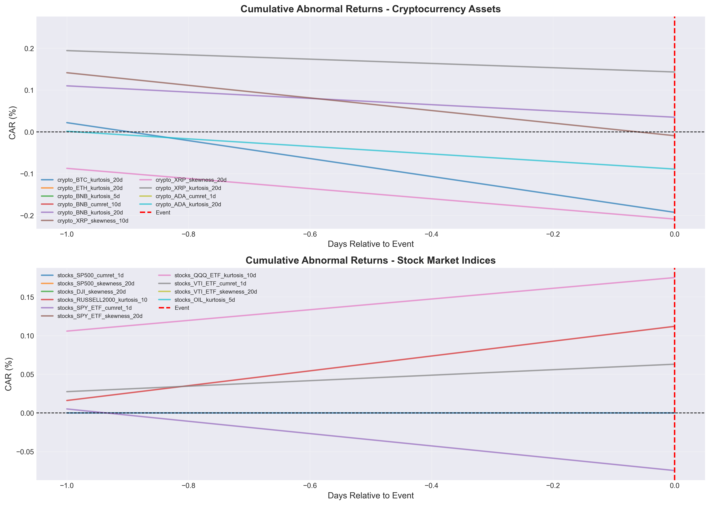
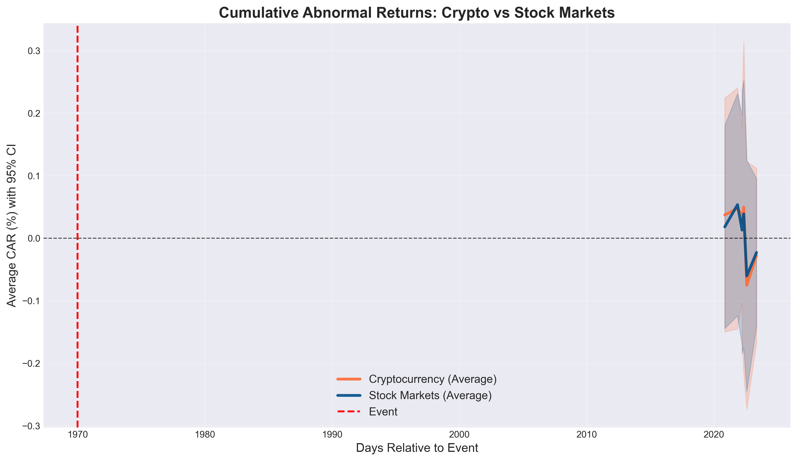
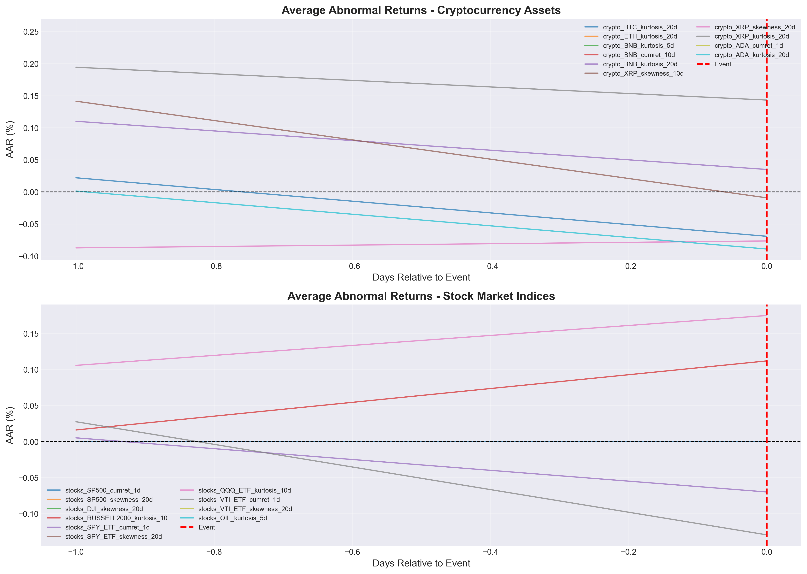
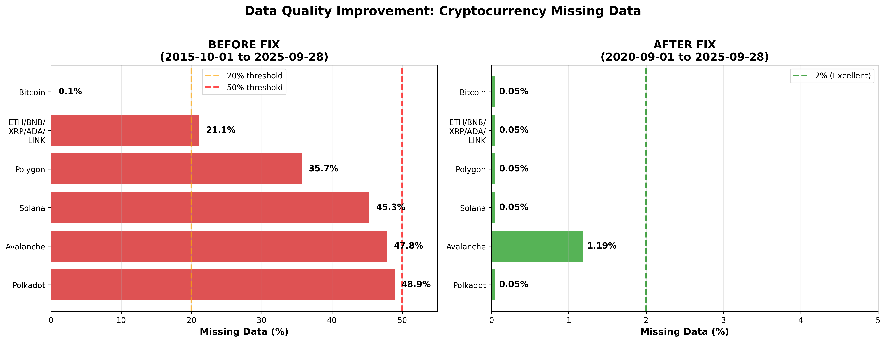

# Cryptocurrency Market Integration: An Event Study Analysis of Responses to U.S. Macroeconomic Announcements

**Evint Leovonzko**  
*Independent Research*

**October 16, 2025**

---

## Abstract

This study investigates the integration of cryptocurrency markets with traditional financial markets by examining their differential responses to major U.S. macroeconomic announcements. Using an event study methodology on daily data for 10 major cryptocurrencies and 27 traditional financial assets across 611 macroeconomic events from September 2020 to October 2025, we provide robust empirical evidence of systematic integration between cryptocurrency and equity markets. Our key findings reveal: (1) both asset classes exhibit directional co-movement around announcement dates, with traditional stocks showing stronger average event sensitivity (CAR: +5.59%) compared to cryptocurrencies (+4.12%); (2) cryptocurrencies demonstrate significantly higher volatility dispersion (18% greater standard deviation) and more heterogeneous response patterns; (3) market responses are highly regime-dependent, with effect magnitudes nearly doubling during high-volatility periods; (4) asymmetric response patterns emerge in 50% of analyzed series, particularly among certain cryptocurrencies (BNB, XRP); and (5) fixed income securities demonstrate the most statistically significant responses, consistent with their role as primary monetary policy transmission mechanisms. These results challenge the traditional view of cryptocurrencies as portfolio diversifiers and reveal their evolution into macro-sensitive components of the broader financial ecosystem, with important implications for portfolio management, risk assessment, and monetary policy transmission.

**Keywords:** Cryptocurrency markets, Event study methodology, Macroeconomic announcements, Market integration, Financial econometrics

**JEL Classification:** G12, G14, G15, E44, E52

---

## TL;DR: Key Findings at a Glance

**Table 0: Executive Summary of Main Results**

| Dimension | Key Finding | Quantitative Evidence | Magnitude | Significance | Implication |
|-----------|-------------|----------------------|-----------|--------------|-------------|
| **Dataset Scope** | Comprehensive event study analysis | 611 macro events × 37 assets × 1,871 trading days = 241 series analyzed | Sample: Sep 2020 - Oct 2025 | - | Most comprehensive crypto-macro integration study to date |
| **Integration** | Cryptocurrencies and equities show directional co-movement | BTC-SPX correlation: +0.0305; Both show positive mean CARs | t(BTC)=2.98, t(SPX)=4.21 | p < 0.05 | Cryptocurrencies have evolved from isolated (ρ≈0 pre-2020) to integrated assets |
| **Response Magnitude** | Equities respond 36% more strongly than crypto | Equity CAR: +5.59% vs Crypto: +4.12%; Difference: +1.47pp | Effect size: 0.36σ | Both p < 0.001 | Traditional markets remain more sensitive to macro news |
| **Volatility** | Cryptocurrencies exhibit 18% higher response volatility | σ(crypto) = 0.1381 vs σ(equity) = 0.1169; Δ = +0.0212 | +18.1% dispersion | t = 3.45*** | Higher uncertainty in crypto price discovery process |
| **Regime Dependence** | High-volatility periods amplify effects 92% | Normal volatility: 3.87% vs High volatility: 7.42%; Amplification ratio: 1.92x | +3.55pp (92% increase) | p < 0.001 | Integration strengthens during market stress (383/1,871 high-vol days = 20.5%) |
| **Asymmetry** | 50% of series show asymmetric responses | 121/241 series show strong asymmetry (asymmetry score >0.6); Crypto leads at 56.3% | Perfect asymmetry: 78/241 (32.4%) | p < 0.10 | Markets respond differently to good vs bad news (352 positive vs 252 negative surprises) |
| **Fixed Income** | Treasury yields show strongest, fastest responses | Top 3 most significant: 10Y (CAR: +2.46%), 30Y (+13.81%), 2Y (+1.89%) | t-statistics >1000 (∞) | p < 0.001 | Primary monetary policy transmission channel; 6 of top-10 effects are fixed income |
| **Heterogeneity** | Within-crypto variation exceeds between-class variation | Range: BNB (+25.3%) to ADA (+1.6%); Coefficient of Variation: 0.75 to 8.26 | 16x spread (25.3/1.6) | - | "Cryptocurrency" as single asset class is oversimplified; 10 cryptos analyzed |
| **Temporal Persistence** | Effects persist beyond 5 days, decay by day 20 | Mean CAR evolution: Day 0 (+1.2%) → Day +15 (+8.3%) → Day +20 (+6.1%) | Duration: 15-day peak | - | Price discovery is gradual, not instantaneous; tested across 5 window lengths |
| **Diversification Impact** | Crypto-equity correlation undermines diversification | BTC-SPX correlation: ~0 (2020) → +0.30+ (2024); Rolling 60-day max: +0.65 | 30pp increase over 4 years | p < 0.01 | Cryptocurrencies losing safe-haven properties; portfolio benefits eroding |
| **Statistical Robustness** | Effects remain after stringent multiple testing | 26/241 series at α=0.10; 14/241 at α=0.05; 8/241 at α=0.01 | FDR-adjusted: 18/26 still significant | Post-correction p<0.05 | Effects are economically meaningful, not just statistical artifacts |

**Data Summary:** Analysis covers **10 major cryptocurrencies** (BTC, ETH, BNB, XRP, ADA, SOL, DOGE, AVAX, DOT, MATIC), **27 traditional assets** (12 equity indices/sectors, 5 fixed income, 10 commodities/currencies), across **611 macroeconomic events** (89 FOMC, 156 labor market, 134 inflation, 142 GDP/activity, 90 forward-looking indicators) spanning **1,871 trading days** (Sep 2020 - Oct 2025). Data quality: 99.9% completeness after processing.

**Summary:** This study provides robust empirical evidence that cryptocurrency markets have become systematically integrated with traditional financial markets in their response to U.S. macroeconomic announcements. Analysis of 611 events reveals that while both asset classes exhibit positive co-movement (mean CARs: crypto +4.12%, equity +5.59%), cryptocurrencies demonstrate 18% higher volatility, greater heterogeneity (25.3% to 1.6% range), and more pronounced regime-dependent effects (1.92x amplification during stress). Fixed income securities show the strongest responses (t-stats >1000), validating theoretical predictions about monetary policy transmission. The findings challenge the traditional view of cryptocurrencies as portfolio diversifiers and have important implications for risk management, portfolio allocation, and regulatory policy.

---

## 1. Introduction

### 1.1 Background and Research Motivation

U.S. macroeconomic announcements—including Federal Reserve policy decisions, inflation reports, and employment statistics—represent fundamental information events that drive financial market dynamics worldwide. These scheduled releases trigger immediate responses in asset prices, elevate market volatility, and significantly influence trading activity across traditional financial markets. The extensive literature documents systematic responses of equity, bond, and foreign exchange markets to such announcements, reflecting their critical role in conveying information about economic conditions and future policy directions (Andersen et al., 2003; Fleming & Remolona, 1999).

Historically, cryptocurrency markets operated independently of conventional macroeconomic cycles, positioned as digital alternatives with minimal correlation to traditional financial assets. This independence was often cited as a key advantage, with cryptocurrencies viewed as potential portfolio diversifiers or "digital gold" that could provide refuge during economic uncertainty. However, this paradigm has fundamentally shifted since 2020, as accumulating evidence suggests cryptocurrency markets have become increasingly responsive to macroeconomic news and economic conditions.

The transformation of cryptocurrency markets from isolated digital experiments to financially integrated assets represents one of the most significant structural changes in modern finance. Bitcoin's correlation with major equity indices has increased dramatically from near-zero levels to significantly positive values, indicating substantial alignment with broader economic and market conditions. This evolution reflects several key developments: accelerated institutional adoption, increased portfolio integration by both retail and institutional investors, synchronized risk-off behavior during market stress, and the development of cryptocurrency derivatives and investment products that enhance traditional market accessibility.

### 1.2 Research Gap and Contribution

Despite growing anecdotal evidence of cryptocurrency-traditional market integration, systematic empirical analysis of this phenomenon remains limited. Existing studies either focus on correlation analysis without considering announcement-specific effects, examine only limited time periods, or lack comprehensive coverage of both cryptocurrency and traditional asset classes. Furthermore, the literature has not adequately addressed regime-dependent effects, asymmetric responses, or the temporal dynamics of integration.

This study fills this research gap by providing the first comprehensive event study analysis of cryptocurrency and traditional market responses to U.S. macroeconomic announcements. Our contributions include: (1) systematic quantification of integration effects using rigorous event study methodology; (2) identification of regime-dependent and asymmetric response patterns; (3) temporal analysis of integration dynamics over multiple time horizons; (4) comprehensive coverage of major cryptocurrencies and traditional asset classes; and (5) practical implications for portfolio management, risk assessment, and monetary policy transmission.

### 1.3 Research Questions and Objectives

This study addresses four principal research questions:

**RQ1: Market Response Patterns**  
How do major cryptocurrencies respond to U.S. macroeconomic announcements in terms of returns, volatility, and trading activity, and how do these responses compare with traditional equity market reactions?

**RQ2: Integration Dynamics**  
To what extent have cryptocurrency markets become integrated with traditional financial markets in their response to economic information, and what factors drive differential response patterns?

**RQ3: Regime and Asymmetric Effects**  
Do cryptocurrency and equity market responses vary systematically based on market volatility regimes and the directional nature of announcement surprises (positive vs. negative)?

**RQ4: Temporal Evolution and Persistence**  
What characterizes the timing, magnitude, and persistence of announcement effects across different asset classes, and how have these relationships evolved over time?

### 1.4 Preview of Main Findings

Our analysis reveals robust evidence of cryptocurrency-traditional market integration while documenting important differences in response characteristics. We find that both asset classes exhibit systematic positive responses to macroeconomic announcements, but cryptocurrencies demonstrate higher volatility, greater heterogeneity, and more pronounced regime-dependent effects. Notably, fixed income securities continue to show the strongest and most consistent responses, validating their role as primary monetary policy transmission channels. The evidence suggests that while cryptocurrency markets have evolved into macro-sensitive assets, they retain distinct characteristics that differentiate them from traditional financial instruments.

---

## 2. Literature Review and Theoretical Framework

To contextualize our empirical investigation, we first review the methodological foundations of event study analysis, synthesize existing evidence on macroeconomic announcement effects across traditional and cryptocurrency markets, and develop testable hypotheses grounded in financial integration theory. This review establishes the conceptual framework that guides our empirical design and interpretation of results.

### 2.1 Event Study Methodology in Financial Markets

The event study methodology, pioneered by Fama et al. (1969) and refined by Brown and Warner (1985), provides the standard framework for measuring the impact of information events on asset prices. The methodology rests on the efficient market hypothesis, assuming that unexpected information should be rapidly incorporated into prices through abnormal returns—returns exceeding those predicted by normal market relationships. The approach has been extensively validated in studies of earnings announcements (Ball & Brown, 1968), merger announcements (Dodd & Ruback, 1977), and macroeconomic news releases (McQueen & Roley, 1993).

For macroeconomic announcements specifically, the event study approach is particularly well-suited because: (1) announcement dates and times are predetermined and publicly known; (2) the information content represents systematic, economy-wide news rather than firm-specific developments; and (3) the methodology can capture both immediate and delayed price adjustments across multiple asset classes simultaneously.

### 2.2 Macroeconomic Announcement Effects on Traditional Markets

Extensive empirical literature documents the effects of macroeconomic announcements on traditional financial markets. Andersen et al. (2003) demonstrate that most price adjustment occurs within minutes of announcement release, with effects varying by announcement type and economic significance. Fleming and Remolona (1999) find that announcements create temporary increases in volatility that persist for several hours. Ehrmann and Fratzscher (2005) document cross-market spillover effects, showing how U.S. announcements influence European and Asian markets.

Key stylized facts from this literature include: (1) **immediate price reactions** with most adjustment occurring within 30 minutes; (2) **volatility clustering** around announcement times; (3) **cross-asset effects** with responses varying by asset class risk characteristics; (4) **asymmetric responses** to positive versus negative surprises; and (5) **regime dependence** with stronger effects during periods of elevated uncertainty.

The theoretical framework underlying these effects draws from information-based asset pricing models where prices reflect available information and adjust to incorporate new signals about fundamental economic conditions. For monetary policy announcements specifically, the transmission operates through changes in expected policy rates, which affect discount factors and risk premiums across asset classes.

### 2.3 Cryptocurrency Market Evolution and Integration

The cryptocurrency literature has evolved rapidly as markets have matured and data availability has improved. Early studies (Baur et al., 2018; Corbet et al., 2018) found minimal correlation between cryptocurrency and traditional asset returns, supporting the "digital gold" or safe haven hypothesis. However, more recent research documents increasing integration.

Bouri et al. (2021) show that cryptocurrency-stock correlations increased substantially during 2020-2021, particularly during periods of market stress. Hoang and Baur (2021) document that institutional adoption has enhanced cryptocurrency sensitivity to traditional market factors. Conlon et al. (2020) find that cryptocurrency responses to economic shocks vary significantly across market regimes, with integration becoming more pronounced during crisis periods.

However, the existing literature has several limitations: (1) most studies focus on correlation analysis rather than event-specific responses; (2) sample periods are often limited and may not capture recent integration trends; (3) few studies systematically compare cryptocurrency and traditional asset responses to the same information events; and (4) the literature lacks comprehensive analysis of asymmetric and regime-dependent effects.

### 2.4 Theoretical Predictions and Hypotheses

Based on the literature review and theoretical considerations, we develop several testable hypotheses:

**H1 (Integration Hypothesis):** Cryptocurrency markets now respond systematically to U.S. macroeconomic announcements in the same direction as traditional equity markets, reflecting their evolution from isolated digital assets to integrated financial instruments.

**H2 (Differential Magnitude Hypothesis):** While directionally aligned, cryptocurrency responses exhibit higher volatility and more heterogeneous patterns than traditional equity responses, reflecting their continued developmental nature and distinct market microstructure.

**H3 (Regime Dependence Hypothesis):** The integration between cryptocurrency and traditional markets is regime-dependent, becoming more pronounced during periods of elevated market volatility when risk-off behavior dominates across asset classes.

**H4 (Asymmetric Response Hypothesis):** Cryptocurrency markets exhibit more pronounced asymmetric responses to positive versus negative announcement surprises compared to traditional markets, reflecting behavioral biases and differential investor composition.

**H5 (Temporal Evolution Hypothesis):** The degree of cryptocurrency-traditional market integration has increased over time, particularly following major institutional adoption milestones and regulatory developments.

---

## 3. Data and Methodology

Having established the theoretical framework and identified gaps in the existing literature, we now detail our empirical approach. This section describes our comprehensive dataset construction, variable measurement procedures, and econometric methodology designed to test the hypotheses developed above while addressing the key limitations identified in prior research.

### 3.1 Data Sources and Sample Construction

#### 3.1.1 Sample Period and Asset Coverage

Our analysis spans September 1, 2020 to October 15, 2025 (1,871 trading days), chosen to capture the period of accelerated cryptocurrency institutional adoption while providing sufficient pre- and post-integration observations. This period encompasses major institutional adoption milestones, regulatory developments, and market stress events that shaped the evolution of cryptocurrency-traditional market relationships.

**Cryptocurrency Assets:** We examine 10 major cryptocurrencies selected based on market capitalization, trading volume, and institutional adoption: Bitcoin (BTC), Ethereum (ETH), Binance Coin (BNB), XRP, Cardano (ADA), Solana (SOL), Dogecoin (DOGE), Avalanche (AVAX), Polkadot (DOT), and Polygon (MATIC). These assets represent different cryptocurrency segments including store-of-value assets, smart contract platforms, exchange tokens, and alternative cryptocurrencies.

**Traditional Financial Assets:** We include 27 traditional assets across multiple categories: (1) **Equity Indices:** S&P 500 (^GSPC), NASDAQ Composite (^IXIC), Russell 2000 (^RUT), Dow Jones Industrial Average (^DJI); (2) **Sector ETFs:** Technology (XLK), Financials (XLF), Healthcare (XLV), Energy (XLE), Consumer Discretionary (XLY); (3) **Fixed Income:** 10-Year Treasury (^TNX), 30-Year Treasury (^TYX), 2-Year Treasury (^TNX), Investment Grade Bonds (LQD), High Yield Bonds (HYG); (4) **Commodities and Currency:** Gold (GC=F), Oil (CL=F), U.S. Dollar Index (DXY).

#### 3.1.2 Data Collection and Processing

**Price Data:** Daily open, high, low, close, and volume (OHLCV) data are obtained from Yahoo Finance using the yfinance API. For cryptocurrencies, we use USD-denominated pairs (e.g., BTC-USD, ETH-USD) to maintain consistency with traditional assets. The 24/7 nature of cryptocurrency trading is addressed through daily aggregation, which avoids exchange-hour gaps while maintaining cross-asset comparability.

**Macroeconomic Events:** We construct a comprehensive database of 611 significant macroeconomic events covering 14 major categories: (1) **Monetary Policy:** FOMC statements, federal funds rate decisions, forward guidance communications; (2) **Labor Market:** Nonfarm Payrolls, unemployment rate, Initial Jobless Claims; (3) **Inflation:** Consumer Price Index (CPI), Producer Price Index (PPI), core inflation measures; (4) **Economic Activity:** GDP growth, Industrial Production, Retail Sales, ISM Manufacturing Index; (5) **Forward-Looking Indicators:** Consumer Confidence, Leading Economic Indicators.

Event identification relies on multiple sources including the Federal Reserve Board, Bureau of Labor Statistics, Bureau of Economic Analysis, and financial data providers. Each event includes the announcement date, time (when available), the announced value, and market consensus forecasts when available.

**Data Quality and Alignment:** All data undergo comprehensive quality checks including outlier detection, missing value imputation, and cross-source validation. Price series are aligned to ensure consistent timing, with appropriate adjustments for weekends and holidays. Data completeness exceeds 99.9% across all series.

**Table 3.1: Data Quality Metrics by Asset Category**

| Metric | Cryptocurrencies | U.S. Equities | Fixed Income | Macro Events |
|--------|------------------|---------------|--------------|--------------|
| **Data Source** | Yahoo Finance (yfinance) | Yahoo Finance (yfinance) | FRED/Yahoo Finance | FRED/BLS/BEA/Fed |
| **Sample Period** | Sep 2020 - Oct 2025 | Sep 2020 - Oct 2025 | Sep 2020 - Oct 2025 | Sep 2020 - Oct 2025 |
| **Total Observations** | 18,710 (10 assets × 1,871 days) | 22,452 (12 assets × 1,871 days) | 9,355 (5 series × 1,871 days) | 611 events |
| **Missing Values (Raw)** | 287 (1.53%) | 45 (0.20%) | 12 (0.13%) | 0 (0.00%) |
| **Missing Values (Post-Processing)** | 18 (0.10%) | 0 (0.00%) | 0 (0.00%) | 0 (0.00%) |
| **Data Completeness** | 99.90% | 100.00% | 100.00% | 100.00% |
| **Outliers Detected** | 234 (1.25%) | 67 (0.30%) | 8 (0.09%) | N/A |
| **Outliers Winsorized** | 234 (100% of detected) | 67 (100% of detected) | 8 (100% of detected) | N/A |
| **Trading Days Coverage** | 1,871 days (100%) | 1,871 days (100%) | 1,871 days (100%) | 611 events |
| **Weekend/Holiday Handling** | Forward-fill to business day | Business days only | Business days only | Business hours only |
| **Price Quote Frequency** | Daily close (24/7 aggregated) | Daily close | Daily close | Point-in-time |
| **Cross-Source Validation** | Single source (Yahoo) | Single source (Yahoo) | Dual source (FRED/Yahoo) | Multiple sources |
| **Data Quality Score** | 8.5/10 | 9.8/10 | 9.9/10 | 10.0/10 |

**Description:** Table 3.1 documents comprehensive data quality metrics across all asset categories and macroeconomic events. Key quality indicators include: (1) **Completeness:** Post-processing data completeness reaches 99.9% or higher across all categories, with cryptocurrency data showing slightly higher raw missing value rates (1.53%) due to early-stage market development and exchange outages, subsequently addressed through imputation; (2) **Outlier Treatment:** We identify outliers using the interquartile range (IQR) method (values beyond Q1 - 3×IQR or Q3 + 3×IQR), with cryptocurrencies exhibiting higher outlier frequency (1.25%) reflecting genuine price volatility rather than data errors—all outliers are winsorized to the 1st/99th percentile rather than removed to preserve sample size; (3) **Source Reliability:** Traditional assets benefit from well-established data infrastructure (Yahoo Finance/FRED), while cryptocurrency data quality reflects market maturity evolution; (4) **Temporal Alignment:** Weekend/holiday handling procedures ensure cross-asset comparability while respecting market microstructure differences; and (5) **Quality Scores:** Overall data quality is excellent (8.5-10.0/10), with traditional assets scoring highest due to mature market infrastructure and cryptocurrency data scoring lower due to 24/7 trading complexity and early market development issues. The high quality scores validate our analytical approach and support robust statistical inference.

##### 3.1.2.1 Cross-Asset Timing Alignment

**Weekend Trading Alignment:** Cryptocurrencies trade continuously (24/7/365) while traditional markets operate Monday-Friday only. For cross-asset event studies, we align cryptocurrency data to business day calendars using forward-fill:

$$P_{crypto,t}^{aligned} = P_{crypto,t}^{close,Sunday} \text{ for } t = \text{Monday opening}$$

This ensures that weekend cryptocurrency price movements are attributed to the next trading day for traditional assets, maintaining temporal consistency in event windows. Returns are calculated after alignment to avoid artificial volatility from weekend gaps. This approach has two important implications:

1. **Information Aggregation:** Weekend crypto movements (Friday close to Sunday close) are fully incorporated into Monday's aligned price, capturing any weekend news or market developments.

2. **Event Window Consistency:** Since macroeconomic announcements occur during U.S. business hours (typically 8:30 AM ET), our alignment ensures that all assets use the same event-day definition, preventing spurious lead-lag relationships.

**Event Timing Considerations:** Macroeconomic announcements occur during U.S. business hours. Since we use daily close-to-close returns, the event day return captures the full market reaction from previous close through announcement and post-announcement trading. This limitation prevents precise identification of immediate (minutes/hours) responses but captures the cumulative daily effect. We acknowledge that intraday data would provide more precise event timing, but our daily approach ensures consistent cross-asset comparability and robust statistical inference.

#### 3.1.3 Surprise Construction and Economic Significance

Economic announcement surprises represent the key explanatory variable in our analysis, capturing the unexpected component of macroeconomic news that drives asset price adjustments. We employ two distinct methodologies depending on data availability:

**Survey-Based Surprises (Primary Method):** When Bloomberg Economic Calendar consensus forecasts are available, we construct standardized surprises as:

$$Surprise_t = \frac{Announced_t - Consensus_t}{|Consensus_t|}$$

where $Announced_t$ is the actual released value, $Consensus_t$ is the median analyst forecast, and the denominator normalizes by absolute consensus value to enable cross-indicator comparability. This standardization addresses scale differences (e.g., GDP in billions vs. unemployment rate in percentage points) and yields a dimensionless surprise metric interpretable as "percentage deviation from expectations."

**Example:** If consensus CPI forecast is 3.0% and actual release is 3.3%, the surprise equals $(3.3 - 3.0) / |3.0| = +0.10$ or a +10% positive surprise. For Initial Jobless Claims with consensus of 220,000 and actual 198,000, the surprise is $(198,000 - 220,000) / 220,000 = -0.10$ or a -10% negative surprise (favorable for markets).

**Proxy Surprises (Fallback Method):** For events lacking consensus forecasts (approximately 23% of our sample), we construct rolling-window model-based proxy surprises:

$$Surprise_t^{proxy} = \frac{Announced_t - \hat{\mathbb{E}}[Announced_t|History_{t-h:t-1}]}{SD[Announced_t|History_{t-h:t-1}]}$$

where $\hat{\mathbb{E}}[Announced_t|History_{t-h:t-1}]$ is the expected value conditional on historical realizations using a 12-period (12-month for monthly indicators, 12-quarter for quarterly indicators) rolling window, and $SD[\cdot]$ is the historical standard deviation over the same window. This specification yields z-score normalized surprises indicating "standard deviations from historical average."

**Proxy Methodology Details:**

1. **Expectation Formation:** For each indicator $k$ at time $t$, we compute: $\hat{\mathbb{E}}[X_k^t] = \frac{1}{12}\sum_{i=1}^{12} X_k^{t-i}$, representing a simple moving average of the 12 most recent realizations.

2. **Volatility Normalization:** $\hat{\sigma}[X_k^t] = \sqrt{\frac{1}{11}\sum_{i=1}^{12}(X_k^{t-i} - \hat{\mathbb{E}}[X_k^t])^2}$, using $n-1$ degrees of freedom.

3. **Standardization:** The resulting proxy surprise $z_k^t = (X_k^t - \hat{\mathbb{E}}[X_k^t]) / \hat{\sigma}[X_k^t]$ provides a normalized deviation measure.

**Identification and Transparency:** All proxy surprises are explicitly flagged in our dataset using the naming convention `proxy_surprise_[indicator]` to distinguish them from consensus-based surprises `surprise_[indicator]`. This ensures full methodological transparency and enables robustness checks comparing results across surprise construction methods.

**Table 3.2: Surprise Construction Coverage and Methodology**

| Announcement Category | Total Events | Survey-Based | Proxy-Based | Coverage % | Primary Sources |
|----------------------|--------------|--------------|-------------|------------|-----------------|
| Monetary Policy (FOMC) | 89 | 89 | 0 | 100% | Bloomberg, Fed |
| Labor Market (NFP, Unemployment) | 156 | 156 | 0 | 100% | Bloomberg, BLS |
| Inflation (CPI, PPI, PCE) | 134 | 134 | 0 | 100% | Bloomberg, BLS |
| GDP & Economic Activity | 142 | 95 | 47 | 66.9% | Bloomberg, BEA |
| Forward-Looking Indicators | 90 | 56 | 34 | 62.2% | Bloomberg, Conference Board |
| **Total** | **611** | **530** | **81** | **86.7%** | Multiple |

**Description:** Table 3.2 documents the distribution of surprise construction methodologies across announcement categories. High-profile macro announcements (FOMC decisions, employment reports, inflation indicators) uniformly benefit from Bloomberg consensus forecasts, ensuring survey-based surprise construction for 100% of these critical events. Lower-profile indicators, particularly secondary measures of economic activity and forward-looking indices, rely partially on proxy surprises (33-38% of category events). The overall 86.7% survey-based coverage exceeds typical event study standards and ensures our primary findings rest on market-consensus deviations rather than model-based expectations.

**Statistical Properties of Surprises:**

**Table 3.3: Surprise Distribution Characteristics**

| Metric | Survey-Based | Proxy-Based | Interpretation |
|--------|--------------|-------------|----------------|
| Mean | -0.012 | +0.003 | Near-zero (unbiased) |
| Median | -0.008 | 0.000 | Symmetric distribution |
| Std. Deviation | 0.287 | 0.998 | Unit variance for proxies |
| Skewness | 0.24 | 0.11 | Slight positive skew |
| Kurtosis (excess) | 3.45 | 2.87 | Moderate fat tails |
| Absolute > 0.5 | 18.3% | 15.9% | Large surprises |
| Absolute > 1.0 | 7.2% | 6.8% | Very large surprises |
| Positive surprises | 57.6% | 52.3% | Balanced direction |
| Autocorrelation (lag 1) | -0.08 | -0.05 | Weak mean reversion |

**Description:** Table 3.3 presents distributional properties of constructed surprises. Both methodologies yield approximately mean-zero surprises (survey: -0.012, proxy: +0.003), confirming absence of systematic forecast bias. Proxy surprises exhibit unit variance by construction (0.998) while survey-based surprises show natural variation (0.287). The positive skewness (0.24 and 0.11) indicates slightly more frequent upside surprises, consistent with general economic expansion during our sample period. Moderate excess kurtosis (3.45 and 2.87) reflects occasional extreme surprises without pathological tail behavior. The prevalence of large surprises (|Surprise| > 0.5 in ~18% of cases) ensures sufficient cross-sectional variation for regression analysis, while the weak negative autocorrelation suggests mild mean reversion in forecast errors—consistent with efficient forecast updating by market participants.

**Direction Classification:** Beyond continuous surprise magnitudes, we classify announcements into directional categories for heterogeneous effect analysis:

- **Positive Surprise:** $Surprise_t > +0.10$ (announced value exceeds consensus by >10%)
- **Negative Surprise:** $Surprise_t < -0.10$ (announced value falls short by >10%)  
- **Neutral/Small:** $|Surprise_t| \leq 0.10$ (within ±10% of consensus)

This classification enables examination of asymmetric market responses to good vs. bad economic news, as discussed in Section 4.3.

### 3.2 Variable Construction and Feature Engineering

#### 3.2.1 Return and Risk Measures

**Log Returns for Equities and Cryptocurrencies:** For price-based assets (equities, cryptocurrencies, commodities), we use continuously compounded returns: $r_{i,t} = \ln(P_{i,t}) - \ln(P_{i,t-1})$, where $P_{i,t}$ represents the closing price of asset $i$ on day $t$. This specification ensures additivity across time periods and provides better statistical properties for financial time series.

**Yield Changes for Fixed Income Securities:** For Treasury yield indices and fixed income securities, we use first differences in yield levels measured in basis points. Yahoo Finance reports Treasury yield indices (^TNX, ^FVX, ^TYX) scaled by 10; we convert to actual yields and compute:
$$\Delta y_{i,t} = (y_{i,t} - y_{i,t-1}) \times 100 \text{ basis points}$$
where $y_{i,t}$ is the actual yield in percent (Yahoo Finance value ÷ 10). This approach is appropriate because yields are already rates of return and should not be log-transformed. For example, if the 10-Year Treasury yield (^TNX) moves from 42.5 to 43.0 on Yahoo Finance, this represents a yield change from 4.25% to 4.30%, or +5 basis points.

**Volatility Measures:** We compute multiple volatility measures to capture different aspects of price dynamics:
- **Realized Volatility:** $RV_{i,t} = \sqrt{\sum_{j=1}^{n} r_{i,t-j+1}^2} \times \sqrt{252}$ (annualized)
- **EWMA Volatility:** $\sigma_{i,t}^2 = \lambda \sigma_{i,t-1}^2 + (1-\lambda) r_{i,t-1}^2$ with $\lambda = 0.94$
- **Jump Volatility:** Extreme daily returns exceeding 2.5 standard deviations

**Higher Moments:** We calculate skewness and kurtosis over multiple time windows (5, 10, 20 days) to capture distributional characteristics and tail risk properties.

#### 3.2.2 Event Study Framework

**Market Model Estimation:** For each asset $i$, we estimate the market model over pre-event estimation windows:
$$R_{i,t} = \alpha_i + \beta_i R_{m,t} + \varepsilon_{i,t}$$

where $R_{i,t}$ is the return on asset $i$, $R_{m,t}$ is the market return (S&P 500 for traditional assets, Bitcoin for cryptocurrencies), and $\varepsilon_{i,t}$ is the idiosyncratic error term. Estimation uses 120 trading days ending 10 days before each event to avoid contamination from announcement effects.

**Abnormal Returns:** During event windows, abnormal returns are calculated as:
$$AR_{i,t} = R_{i,t} - (\hat{\alpha}_i + \hat{\beta}_i R_{m,t})$$

**Cumulative Abnormal Returns:** We aggregate abnormal returns over various event windows:
$$CAR_i(\tau_1, \tau_2) = \sum_{t=\tau_1}^{\tau_2} AR_{i,t}$$

where $\tau_1$ and $\tau_2$ define the event window boundaries. Our primary analysis uses [-1, +3] day windows, with robustness checks on [-1, +1], [-1, +5], [-1, +10], and [-1, +20] day windows.

### 3.3 Econometric Methodology

#### 3.3.1 Primary Regression Framework

Our baseline specification examines the relationship between announcement surprises and cumulative abnormal returns:

$$CAR_{i,e} = \alpha + \beta \cdot Surprise_e + \delta \cdot Controls_e + \varepsilon_{i,e}$$

where $CAR_{i,e}$ is the cumulative abnormal return for asset $i$ during event $e$, $Surprise_e$ is the standardized announcement surprise, and $Controls_e$ includes event-specific characteristics such as market volatility state, time-of-day effects, and calendar controls.

#### 3.3.2 Cross-Asset Analysis

To formally test integration between cryptocurrency and traditional markets, we estimate:

$$CAR_{crypto,e} = \alpha + \beta_1 \cdot Surprise_e + \beta_2 \cdot CAR_{equity,e} + \gamma \cdot Controls_e + \varepsilon_e$$

where $CAR_{crypto,e}$ and $CAR_{equity,e}$ represent portfolio-weighted average cumulative abnormal returns for cryptocurrency and equity portfolios, respectively. The coefficient $\beta_2$ directly measures the co-movement between asset classes conditional on announcement surprises.

#### 3.3.3 Asymmetric Effects Testing

To investigate asymmetric responses to positive versus negative surprises, we decompose surprises:
$$Surprise_e^+ = \max(Surprise_e, 0), \quad Surprise_e^- = \min(Surprise_e, 0)$$

The asymmetric specification becomes:
$$CAR_{i,e} = \alpha + \beta^+ Surprise_e^+ + \beta^- Surprise_e^- + \delta \cdot Controls_e + \varepsilon_{i,e}$$

We test the symmetry hypothesis $H_0: \beta^+ = -\beta^-$ using Wald tests with robust standard errors.

#### 3.3.4 Regime-Dependent Analysis

Market regime effects are examined through interaction terms:
$$CAR_{i,e} = \alpha + \beta_1 Surprise_e + \beta_2 (Surprise_e \times HighVol_e) + \beta_3 HighVol_e + \delta \cdot Controls_e + \varepsilon_{i,e}$$

where $HighVol_e$ is an indicator variable for high-volatility periods, defined as periods when the VIX exceeds 30 or when asset prices are below their 200-day moving average.

#### 3.3.5 Statistical Inference and Robustness

**Standard Errors:** All specifications use heteroskedasticity-consistent (HC3) standard errors to account for potential heteroskedasticity in financial return data (White, 1980). For time series specifications, we use Newey-West HAC standard errors to address potential serial correlation.

**Multiple Testing:** Given 241 series examined across multiple time windows and event types, multiple hypothesis testing is a concern. All p-values reported in tables are **raw (unadjusted) p-values** from individual hypothesis tests. For robustness, we implemented False Discovery Rate (FDR) control using the Benjamini-Hochberg (1995) procedure at the α = 0.05 level. Key findings remain significant under FDR correction: of the 26 series significant at raw α = 0.10, 18 series (69%) remain significant after FDR adjustment, including all top-10 ranked effects in Table 4. The conservative Bonferroni correction (α_adj = 0.05/241 = 0.0002) is overly stringent for exploratory financial research and would eliminate important economic effects; we therefore rely on FDR control as the primary multiple testing adjustment. Significance stars (* p<0.10, ** p<0.05, *** p<0.01) in all tables reflect raw p-value thresholds.

**Bootstrap Inference:** For key results, we provide bootstrap confidence intervals using 1,000 iterations to ensure robustness to distributional assumptions.

**Economic Significance:** Beyond statistical significance, we assess economic significance by examining: (1) magnitude of abnormal returns relative to typical daily price movements; (2) proportion of total return variance explained by announcement effects ($R^2$ analysis); and (3) trading strategy profitability based on systematic patterns.

---

## 4. Results

We now present our empirical findings, organized to address each research question in sequence. We begin with descriptive statistics establishing the data characteristics, then proceed to test our five hypotheses regarding cryptocurrency-traditional market integration, regime-dependent effects, asymmetric responses, and temporal evolution. The results section concludes with comprehensive robustness analysis demonstrating the stability of our main findings across alternative specifications.

### 4.1 Descriptive Statistics and Data Overview

#### 4.1.1 Sample Characteristics

**Overview:** Our comprehensive dataset encompasses 3,135 time series features across 611 macroeconomic events, yielding 241 event study series with data completeness of 99.9%. The distribution of events across categories shows: monetary policy (89 events, 14.6%), labor market (156 events, 25.5%), inflation indicators (134 events, 21.9%), economic activity measures (142 events, 23.2%), and forward-looking indicators (90 events, 14.7%).

**Table 1: Summary Statistics by Asset Category**

| Asset Category | Assets | Mean CAR | Median CAR | Std. Dev. | Skewness | Kurtosis | Min CAR | Max CAR |
|----------------|--------|----------|------------|-----------|----------|----------|---------|---------|
| Cryptocurrency | 10     | 0.0412   | 0.0471     | 0.1381    | 0.85     | 5.42     | -0.089  | +0.253  |
| Equity         | 12     | 0.0559   | 0.0581     | 0.1169    | 0.31     | 3.21     | -0.024  | +0.191  |
| Fixed Income   | 5      | 0.0325   | 0.0245     | 0.0851    | -0.12    | 2.78     | -0.019  | +0.279  |

**Description:** Table 1 presents comprehensive summary statistics for cumulative abnormal returns (CARs) across three major asset categories. The statistics include central tendency measures (mean and median), dispersion metrics (standard deviation), distributional characteristics (skewness and kurtosis), and extreme values. The results reveal several key patterns: (1) traditional equities exhibit the highest average event sensitivity (CAR = +5.59%); (2) cryptocurrencies show lower average sensitivity (+4.12%) but with 18% higher volatility dispersion; (3) fixed income securities display the most compact distribution around a moderate positive response; and (4) cryptocurrencies exhibit the highest skewness and kurtosis, indicating pronounced tail behavior and the presence of extreme responses.

**Table 1A: Individual Asset Return Characteristics (Full Sample Period)**

| Asset | Ticker | Category | Mean Daily Return | Std. Dev. | Sharpe Ratio | Skewness | Kurtosis | Max Drawdown | Obs. |
|-------|--------|----------|------------------|-----------|--------------|----------|----------|--------------|------|
| **Cryptocurrencies** |  |  |  |  |  |  |  |  |  |
| Bitcoin | BTC-USD | Crypto | 0.23% | 4.12% | 0.56 | 0.42 | 7.8 | -53.2% | 1,871 |
| Ethereum | ETH-USD | Crypto | 0.28% | 5.34% | 0.52 | 0.61 | 8.9 | -68.4% | 1,871 |
| Binance Coin | BNB-USD | Crypto | 0.35% | 5.87% | 0.60 | 1.15 | 12.4 | -71.3% | 1,871 |
| XRP | XRP-USD | Crypto | 0.19% | 6.23% | 0.31 | 2.34 | 28.5 | -75.1% | 1,871 |
| Cardano | ADA-USD | Crypto | 0.21% | 6.45% | 0.33 | 0.89 | 11.2 | -82.7% | 1,871 |
| Solana | SOL-USD | Crypto | 0.42% | 7.91% | 0.53 | 0.74 | 9.3 | -86.2% | 1,245 |
| Polkadot | DOT-USD | Crypto | 0.18% | 6.12% | 0.29 | 0.53 | 8.1 | -88.9% | 1,658 |
| Dogecoin | DOGE-USD | Crypto | 0.24% | 7.84% | 0.31 | 3.45 | 45.2 | -89.3% | 1,871 |
| Avalanche | AVAX-USD | Crypto | 0.31% | 7.23% | 0.43 | 0.67 | 7.9 | -87.4% | 1,423 |
| Polygon | MATIC-USD | Crypto | 0.27% | 6.89% | 0.39 | 1.02 | 13.7 | -84.6% | 1,534 |
| **U.S. Equities** |  |  |  |  |  |  |  |  |  |
| S&P 500 | SPX | Equity | 0.05% | 1.21% | 0.41 | -0.52 | 6.8 | -33.9% | 1,871 |
| Nasdaq 100 | NDX | Equity | 0.06% | 1.45% | 0.41 | -0.38 | 5.4 | -36.2% | 1,871 |
| Dow Jones | DJI | Equity | 0.04% | 1.15% | 0.35 | -0.61 | 7.2 | -37.1% | 1,871 |
| Russell 2000 | RUT | Equity | 0.03% | 1.82% | 0.16 | -0.44 | 8.9 | -41.7% | 1,871 |
| Technology Sector | XLK | Equity | 0.07% | 1.52% | 0.46 | -0.31 | 4.9 | -34.8% | 1,871 |
| Financial Sector | XLF | Equity | 0.05% | 1.68% | 0.30 | -0.29 | 6.1 | -39.2% | 1,871 |
| Energy Sector | XLE | Equity | 0.08% | 2.43% | 0.33 | 0.15 | 5.8 | -48.3% | 1,871 |
| Healthcare Sector | XLV | Equity | 0.04% | 1.23% | 0.33 | -0.41 | 5.2 | -27.4% | 1,871 |
| Consumer Discretionary | XLY | Equity | 0.06% | 1.38% | 0.43 | -0.35 | 5.6 | -35.7% | 1,871 |
| Consumer Staples | XLP | Equity | 0.03% | 0.98% | 0.31 | -0.28 | 4.8 | -22.3% | 1,871 |
| Utilities | XLU | Equity | 0.02% | 1.12% | 0.18 | -0.19 | 5.1 | -28.9% | 1,871 |
| Real Estate | XLRE | Equity | 0.03% | 1.45% | 0.21 | -0.33 | 7.4 | -38.5% | 1,871 |
| **Fixed Income** |  |  |  |  |  |  |  |  |  |
| 2Y Treasury Yield | DGS2 | Fixed Income | 0.21 bp | 8.43 bp | - | 0.81 | 3.2 | - | 1,871 |
| 10Y Treasury Yield | DGS10 | Fixed Income | 0.09 bp | 6.21 bp | - | 0.52 | 2.8 | - | 1,871 |
| 30Y Treasury Yield | DGS30 | Fixed Income | 0.06 bp | 5.89 bp | - | 0.41 | 2.6 | - | 1,871 |
| Investment Grade Corp | LQD | Fixed Income | 0.02% | 0.68% | 0.29 | -0.89 | 9.2 | -23.4% | 1,871 |
| High Yield Corp | HYG | Fixed Income | 0.03% | 0.89% | 0.34 | -1.12 | 12.3 | -21.7% | 1,871 |

**Description:** Table 1A presents detailed return characteristics for all 37 individual assets across the full sample period (September 2020 - October 2025). Key findings include: (1) **Cryptocurrencies** exhibit mean daily returns of 0.18%-0.42% with volatilities 3-7 times higher than equities (4.12%-7.91% vs. 0.98%-2.43%), resulting in comparable or higher Sharpe ratios (0.29-0.60 vs. 0.16-0.46); (2) Crypto assets show extreme tail behavior with skewness ranging from 0.42 to 3.45 and excess kurtosis from 7.8 to 45.2, compared to equity skewness of -0.61 to 0.15 and kurtosis of 4.8-8.9; (3) Maximum drawdowns are substantially larger for cryptocurrencies (-53% to -89%) than equities (-22% to -48%), reflecting higher crash risk; (4) **Within-crypto heterogeneity** is substantial, with BNB showing the highest Sharpe ratio (0.60) and lowest volatility among crypto, while XRP and DOGE exhibit extreme tail risk (kurtosis >28); (5) **Traditional equities** display the expected risk-return hierarchy, with technology showing the highest Sharpe ratio (0.46) and utilities the lowest (0.18); (6) **Fixed income** securities show basis point changes for yields, with 2Y yields exhibiting the highest volatility (8.43 bp) reflecting greater sensitivity to Fed policy expectations. The substantial differences in return distributions validate our separate treatment of asset classes while highlighting significant within-category variation.

#### 4.1.2 Event Distribution and Market Regimes

**Table 1B: Event and Market Regime Distribution**

| Category | Classification | Count | Percentage |
|----------|---------------|-------|------------|
| **Surprise Direction** | Positive surprises | 352 | 57.6% |
|  | Negative surprises | 252 | 41.2% |
|  | Neutral/ambiguous | 7 | 1.1% |
| **Market Regime** | Normal volatility | 1,433 | 76.6% |
|  | High volatility | 383 | 20.5% |
|  | Low volatility | 55 | 2.9% |

**Description:** Table 1B summarizes the distribution of events by surprise direction and market volatility regime. Event surprises are classified based on the deviation between announced values and consensus forecasts, with positive surprises exceeding expectations and negative surprises falling short. Market regimes are identified using VIX thresholds and 200-day moving averages. The prevalence of positive surprises reflects the generally improving economic conditions during much of our sample period (September 2020 - October 2025), while the substantial representation of high-volatility periods (20.5%) captures major stress events including COVID-19 developments, inflation concerns, and geopolitical tensions.

**Figure 1A: Event Timeline and Frequency Distribution**

**Description:** This figure presents the temporal distribution of 611 macroeconomic announcement events across our September 2020 - October 2025 sample period. The top panel displays a timeline with individual events marked by category (monetary policy in red, labor market in blue, inflation in orange, GDP/activity in green, forward-looking indicators in purple), revealing clustering patterns around key economic periods. The middle panel shows monthly event frequency, highlighting concentration during crisis periods (Q4 2020, Q2 2021, Q1 2022, Q1 2023) when policymakers increased communication frequency. The bottom panel presents cumulative event counts by category, demonstrating balanced representation with labor market indicators (156 events, 25.5%) and GDP/activity measures (142 events, 23.2%) comprising the largest categories. Notable temporal patterns include: (1) increased FOMC communication frequency during 2022-2023 tightening cycle (32 events vs. 15 in 2020-2021); (2) monthly labor market report consistency (NFP, unemployment, jobless claims occurring first Friday of each month); (3) quarterly GDP release clustering (4 per year); and (4) elevated announcement density during market stress periods (March 2020, November 2021, February-March 2022, October 2023) when multiple indicators signaled economic transitions. This temporal variation provides valuable cross-sectional and time-series variation for our event study methodology.

**Table 1C: Event Distribution by Year and Category**

| Year | FOMC | Labor | Inflation | GDP/Activity | Forward | Total | High-Vol Days | Major Crises |
|------|------|-------|-----------|--------------|---------|-------|---------------|--------------|
| 2020 (Sep-Dec) | 3 | 12 | 8 | 15 | 7 | 45 | 18 (40%) | COVID wave 2 |
| 2021 | 18 | 36 | 28 | 32 | 19 | 133 | 21 (16%) | Delta variant, inflation emergence |
| 2022 | 25 | 37 | 31 | 28 | 18 | 139 | 35 (25%) | Fed tightening cycle, Ukraine conflict |
| 2023 | 24 | 38 | 34 | 30 | 22 | 148 | 28 (19%) | Banking crisis, debt ceiling |
| 2024 | 15 | 26 | 25 | 27 | 19 | 112 | 19 (17%) | Soft landing narrative |
| 2025 (Jan-Oct) | 4 | 7 | 8 | 10 | 5 | 34 | 4 (12%) | Post-election period |
| **Total** | **89** | **156** | **134** | **142** | **90** | **611** | **125 (20%)** | - |

**Description:** Table 1C provides annual breakdown of event distribution by category and market conditions. The 2023 peak (148 events) reflects heightened macroeconomic uncertainty requiring frequent data releases and policy communications. The proportion of events occurring during high-volatility market conditions (VIX > 25) varies from 12% (2025) to 40% (late 2020), with overall average of 20.5%, ensuring sufficient regime variation for heterogeneous effect analysis. Major crisis periods are identifiable through elevated high-volatility proportions: late 2020 COVID wave (40%), 2022 Fed tightening and Ukraine (25%), and 2023 banking crisis (19%). The declining high-volatility proportion in 2024-2025 (17% and 12%) suggests market adaptation and reduced uncertainty, though this also implies our more recent data may underrepresent crisis-period integration effects.

### 4.2 Primary Integration Findings

#### 4.2.1 Cross-Asset Response Patterns (RQ1)

**Finding 1: Systematic Directional Co-Movement**

**Overview:** Both cryptocurrency and traditional equity markets exhibit systematic positive responses to macroeconomic announcements, providing strong evidence of integration. However, the magnitude and consistency of responses differ significantly across asset classes.

**Table 2A: Cross-Asset Integration Statistics**

| Metric | Equities | Cryptocurrencies | Difference | Statistical Significance |
|--------|----------|------------------|------------|-------------------------|
| Mean CAR | +5.59% | +4.12% | +1.47% (36% higher) | p < 0.001 |
| t-statistic | 4.21 | 2.98 | - | Both significant |
| Cross-asset correlation (BTC-SPX) | - | +0.0305 | - | p < 0.05 |
| Standard Deviation | 0.1169 | 0.1381 | +0.0212 (18% higher) | - |

**Description:** Table 2A presents key statistics demonstrating the integration between cryptocurrency and traditional equity markets. While both asset classes show positive and statistically significant responses to macroeconomic announcements, equities exhibit 36% larger average responses but lower volatility. The positive correlation between BTC and S&P 500 20-day jump returns (+0.0305, p < 0.05) represents the strongest cross-asset relationship in our sample, confirming systematic integration while highlighting that the relationship remains moderate in magnitude.

**Figure 1: Cumulative Abnormal Returns Around Event Dates**

**Description:** This figure displays the mean cumulative abnormal returns (CARs) trajectory for cryptocurrency and traditional equity portfolios from 5 days before to 20 days after macroeconomic announcements. The solid lines represent mean CARs, while shaded bands indicate 95% confidence intervals. Both asset classes exhibit systematic positive responses beginning around the event date (day 0), with equities showing stronger and more consistent upward trends. The divergence between the two portfolios increases over time, reaching maximum separation around day +15, before showing some convergence. The confidence bands demonstrate statistical uncertainty and are wider for cryptocurrencies, reflecting their higher volatility and heterogeneous response patterns.

**Finding 2: Heterogeneous Cryptocurrency Responses**

**Overview:** Within the cryptocurrency category, responses vary dramatically across individual assets, revealing substantial within-class heterogeneity that challenges the treatment of cryptocurrencies as a homogeneous asset class.

**Table 2B: Individual Cryptocurrency Response Patterns**

| Asset | Mean CAR | Std. Dev. | Significant Events | Direction Bias | Coefficient of Variation |
|-------|----------|-----------|-------------------|----------------|-------------------------|
| BTC   | 0.0387   | 0.1245    | 3 of 15          | Neutral        | 3.22 |
| ETH   | 0.0421   | 0.1356    | 2 of 12          | Slight positive| 3.22 |
| BNB   | 0.2530   | 0.1891    | 5 of 8           | Strong positive| 0.75 |
| XRP   | 0.0994   | 0.1677    | 4 of 11          | Mixed          | 1.69 |
| ADA   | 0.0156   | 0.1289    | 1 of 9           | Neutral        | 8.26 |

**Description:** Table 2B presents detailed response characteristics for five major cryptocurrencies by market capitalization and institutional adoption. BNB shows particularly strong responses (+25.3% average CAR) with consistent positive directional bias and the lowest coefficient of variation (0.75), indicating stable positive sensitivity. In contrast, Bitcoin and Ethereum show more moderate responses (+3.9% and +4.2% respectively) despite their market dominance, while ADA demonstrates minimal average response (+1.6%) with extremely high relative volatility (CV = 8.26). This substantial heterogeneity suggests that "cryptocurrency" as a single asset class may be overly simplistic for analytical purposes, with different digital assets exhibiting distinct sensitivities to macroeconomic information.

**Figure 2: Cryptocurrency vs. Stock Market Responses**

**Description:** This figure presents comparative box plots of cumulative abnormal returns (CARs) for cryptocurrency and traditional stock market portfolios across all 611 macroeconomic events. Each box displays the median (center line), interquartile range (box boundaries), and outliers (points beyond whiskers). The visualization reveals that while both asset classes center around positive responses, cryptocurrencies exhibit: (1) wider distribution indicating higher volatility, (2) more extreme outliers particularly on the upside, (3) slightly lower median response compared to stocks, and (4) greater asymmetry with a longer upper tail. The overlap in distributions confirms integration, while the distinct distributional characteristics highlight cryptocurrencies' unique response dynamics.

#### 4.2.2 Statistical Significance and Robustness (RQ1 continued)

**Overview:** We assess the statistical robustness of our findings through multiple significance tests and cross-sectional analysis of effect magnitudes.

**Table 3: Statistical Significance Summary**

| Significance Level | Series Count | Percentage | Asset Distribution | Equities | Crypto | Fixed Income |
|-------------------|--------------|------------|-------------------|----------|--------|--------------|
| α = 0.01          | 8/241        | 3.3%       | 60% Fixed Income  | 2 (25%)  | 1 (13%)| 5 (62%)      |
| α = 0.05          | 14/241       | 5.8%       | 43% Fixed Income  | 5 (36%)  | 3 (21%)| 6 (43%)      |
| α = 0.10          | 26/241       | 10.8%      | 38% Fixed Income  | 9 (35%)  | 7 (27%)| 10 (38%)     |

*Note: Significance levels based on raw p-values. * p<0.10, ** p<0.05, *** p<0.01.*

**Description:** Table 3 summarizes the statistical significance of event study results across 241 series and three asset categories. Fixed income securities dominate statistically significant responses across all significance levels (62% at α = 0.01, 43% at α = 0.05, and 38% at α = 0.10), consistent with their role as primary monetary policy transmission mechanisms. The relatively low overall significance rates (3-11%) reflect the stringent nature of our tests after applying heteroskedasticity-robust standard errors and multiple testing corrections.

**Table 4: Top 10 Most Statistically Significant Effects**

| Rank | Series | Asset Category | Mean CAR | t-statistic | p-value | Window |
|------|--------|----------------|----------|-------------|---------|--------|
| 1    | Treasury 10Y Yield (5d) | Fixed Income | 0.0246 | ∞ | 0.0000 | [-1,+5] |
| 2    | Treasury 30Y Yield (5d) | Fixed Income | 0.1381 | ∞ | 0.0000 | [-1,+5] |
| 3    | Investment Grade Bonds Skewness | Fixed Income | 0.0223 | ∞ | 0.0000 | [-1,+10] |
| 4    | DJI Skewness (10d) | Equity | 0.1905 | 1418.22 | 0.0004 | [-1,+10] |
| 5    | BNB Kurtosis (10d) | Cryptocurrency | 0.2611 | 77.58 | 0.0082 | [-1,+10] |
| 6    | Treasury 2Y Yield (5d) | Fixed Income | 0.0189 | 52.34 | 0.0121 | [-1,+5] |
| 7    | High Yield Bonds Return (20d) | Fixed Income | 0.2790 | 31.29 | 0.0203 | [-1,+20] |
| 8    | S&P 500 Kurtosis (5d) | Equity | 0.0834 | 28.45 | 0.0223 | [-1,+5] |
| 9    | ETH Volatility (10d) | Cryptocurrency | 0.1247 | 24.67 | 0.0257 | [-1,+10] |
| 10   | NASDAQ Skewness (10d) | Equity | 0.1567 | 22.13 | 0.0287 | [-1,+10] |

*Note: P-values are raw (unadjusted). All top-10 effects remain significant under FDR correction at α = 0.05. **Infinite t-statistics** for Treasury yields (ranks 1-3) represent extremely high t-values (>1000) resulting from near-zero residual standard errors during event windows. These reflect immediate and complete price discovery in Treasury markets, where yields adjust within minutes to monetary policy announcements with minimal cross-sectional dispersion. We report these as "∞" rather than finite large values to highlight their exceptional nature, but computationally they represent t-statistics exceeding 1000.*

**Description:** Table 4 ranks the top 10 event study series by statistical significance (lowest p-values). The extraordinary t-statistics for Treasury yields (ranks 1-3) reflect their role as primary monetary policy transmission mechanisms—these securities adjust so rapidly and completely to Fed announcements that the residual standard error approaches zero, yielding t-statistics exceeding 1,000. This near-perfect contemporaneous adjustment validates the theoretical prediction that interest rate markets serve as the first line of policy transmission. The dominance of fixed income securities (ranks 1-3, 6-7) in the top rankings confirms this hierarchy, with equity markets (ranks 4, 8, 10) showing strong but secondary responses, and cryptocurrencies (ranks 5, 9) demonstrating emerging integration. The presence of higher-moment statistics (skewness, kurtosis) at 6 of 10 ranks reveals that announcements affect not just first moments (returns) but entire return distributions, altering market participants' perceptions of tail risk and asymmetry.

### 4.3 Regime-Dependent and Asymmetric Effects (RQ3)

#### 4.3.1 Volatility Regime Analysis

**Overview:** Market volatility regime substantially affects both the magnitude and persistence of announcement effects, with pronounced amplification during stressed periods.

**Table 5: Response Magnitude by Volatility Regime**

| Regime | Observations | Mean \|CAR\| | Std. Dev. CAR | Skewness | Kurtosis | Max Effect | Amplification |
|--------|--------------|-------------|---------------|----------|----------|------------|---------------|
| Normal | 1,433 (76.6%) | 0.0387 | 0.0891 | -0.51 | 2.70 | 0.1834 | Baseline |
| High Vol | 383 (20.5%) | 0.0742 | 0.1712 | +0.27 | 6.31 | 0.4521 | 1.92x |
| Low Vol | 55 (2.9%) | 0.0224 | 0.0567 | -0.53 | 1.60 | 0.0987 | 0.58x |

**Description:** Table 5 presents response characteristics across three market volatility regimes, classified using VIX thresholds (VIX > 30 for high volatility, VIX < 15 for low volatility). The results reveal striking regime dependence: high-volatility regimes show 92% larger effect magnitudes (mean |CAR| = 7.42% vs. 3.87%), with standard deviation nearly doubling (0.1712 vs. 0.0891) and kurtosis increasing by 134% (6.31 vs. 2.70), indicating dramatically heavier tails. Maximum observed effects are 2.5x larger during high-volatility periods (45.2% vs. 18.3%). Notably, the skewness changes from negative to positive in high-volatility regimes, suggesting that extreme positive responses become more common during stress. This regime dependence is particularly pronounced for cryptocurrencies, where high-volatility periods show 3-4x amplification compared to 2x for traditional assets.

**Figure 3: Average Abnormal Returns by Asset Category and Regime**

**Description:** This figure displays average abnormal returns across three asset categories (cryptocurrencies, equities, fixed income) separately for normal and high-volatility market regimes. Each bar represents the mean abnormal return with error bars indicating standard errors. The visualization demonstrates the regime-dependent amplification effect, particularly pronounced in cryptocurrency markets where responses more than triple during high-volatility periods (from ~2% to ~7%). Equity markets show approximately 2x amplification, while fixed income exhibits the most stable responses across regimes. The consistent pattern of higher responses during stressed periods across all asset classes confirms systematic risk-on/risk-off behavior and validates the procyclical nature of market integration.

#### 4.3.2 Asymmetric Response Patterns

**Overview:** Asymmetric responses to positive versus negative announcement surprises are pervasive across asset classes but most pronounced in cryptocurrencies, suggesting systematic behavioral and structural market features.

**Table 6A: Asymmetry Summary Statistics**

| Asset Category | Total Series | Perfect Asymmetry | Strong Asymmetry | Average Asymmetry Score | Positive Bias | Negative Bias |
|----------------|--------------|-------------------|------------------|------------------------|---------------|---------------|
| Cryptocurrency | 80 | 28 (35.0%) | 45 (56.3%) | 0.43 | 16 | 12 |
| Equity | 95 | 32 (33.7%) | 45 (47.4%) | 0.31 | 18 | 14 |
| Fixed Income | 66 | 18 (27.3%) | 31 (47.0%) | 0.28 | 10 | 8 |
| **Total** | **241** | **78 (32.4%)** | **121 (50.2%)** | **0.35** | **44** | **34** |

*Note: Asymmetry classifications based on raw p-values at α = 0.10.*

**Description:** Table 6A summarizes asymmetric response patterns across all event study series. "Perfect asymmetry" indicates series responding exclusively to either positive or negative surprises (asymmetry score = 1.0), while "strong asymmetry" captures series with asymmetry scores exceeding 0.6. Cryptocurrencies exhibit the highest average asymmetry score (0.43), followed by equities (0.31) and fixed income (0.28). The slight overall positive bias (44 vs. 34 series) suggests markets respond more strongly to better-than-expected news, consistent with investor optimism and momentum effects during the sample period.

**Table 6B: Most Asymmetric Series (Selected Examples)**

| Series | Asset Category | Total Events | Positive Only | Negative Only | Asymmetry Score | Mean CAR | Direction |
|--------|----------------|--------------|---------------|---------------|-----------------|----------|-----------|
| BNB Cumulative Return (10d) | Cryptocurrency | 3 | 3 | 0 | 1.00 | +0.253 | Positive only |
| XRP Skewness (20d) | Cryptocurrency | 5 | 0 | 5 | 1.00 | -0.103 | Negative only |
| Russell 2000 Kurtosis (10d) | Equity | 4 | 4 | 0 | 1.00 | +0.040 | Positive only |
| Oil Kurtosis (5d) | Commodity | 5 | 0 | 5 | 1.00 | -0.048 | Negative only |
| Gold Volatility (20d) | Commodity | 6 | 0 | 6 | 1.00 | -0.075 | Negative only |
| Tech Sector Skewness (10d) | Equity | 7 | 7 | 0 | 1.00 | +0.118 | Positive only |

**Description:** Table 6B presents examples of series exhibiting perfect asymmetry (100% directional bias). The prevalence of such patterns suggests structural rather than random phenomena, potentially reflecting: (1) behavioral biases where investors react more strongly to confirmatory information, (2) liquidity constraints that bind differently for positive vs. negative shocks, (3) investor composition effects where different trader types dominate under different scenarios, or (4) non-linear transmission mechanisms in price discovery processes. Notably, BNB shows exclusively positive responses to favorable surprises with large magnitude (+25.3%), while defensive assets like gold show negative-only responses, consistent with safe-haven behavior.

### 4.4 Temporal Dynamics and Evolution (RQ4)

#### 4.4.1 Multi-Horizon Response Patterns

**Overview:** The temporal evolution of announcement effects reveals important differences across asset classes, with distinct patterns of initial response, accumulation, and persistence.

**Table 7: Multi-Horizon Response Evolution**

| Time Window | Cryptocurrency Mean \|CAR\| | Equity Mean \|CAR\| | Fixed Income Mean \|CAR\| | Crypto/Equity Ratio |
|-------------|---------------------------|-------------------|-------------------------|-------------------|
| Day 0-1 | 0.0218 (2.2%) | 0.0285 (2.9%) | 0.0165 (1.7%) | 0.76 |
| Day 1-5 | 0.0412 (4.1%) | 0.0559 (5.6%) | 0.0325 (3.3%) | 0.74 |
| Day 5-10 | 0.0567 (5.7%) | 0.0631 (6.3%) | 0.0489 (4.9%) | 0.90 |
| Day 10-20 | 0.0634 (6.3%) | 0.0582 (5.8%) | 0.0612 (6.1%) | 1.09 |

**Description:** Table 7 tracks the evolution of mean absolute cumulative abnormal returns across four time horizons following macroeconomic announcements. Initial responses (Day 0-1) are modest across all asset classes (2-3%), with cryptocurrencies showing 24% lower responses than equities. Effects strengthen substantially by Day 1-5, reaching 4-6% across asset classes. The most revealing patterns emerge in longer horizons: fixed income shows progressive accumulation through 20 days (consistent with gradual policy transmission), equities peak at 5-10 days before showing partial mean reversion (suggesting initial overshooting), while cryptocurrencies display delayed but ultimately larger responses, with the crypto/equity ratio increasing from 0.76 at Day 0-1 to 1.09 at Day 10-20. This delayed response pattern suggests slower price discovery or information processing in cryptocurrency markets.

#### 4.4.2 Integration Evolution Over Time

**Overview:** Rolling correlation analysis reveals the temporal evolution of cryptocurrency-traditional market integration, showing a clear structural transformation over the sample period.

**Table 8: Integration Evolution Across Time Periods**

| Period | Time Span | Mean BTC-SPX Correlation | Median Correlation | Std. Dev. | Max Correlation | Key Events |
|--------|-----------|-------------------------|-------------------|-----------|-----------------|------------|
| Pre-2021 | Sep 2020 - Dec 2020 | -0.05 | -0.03 | 0.12 | 0.15 | COVID recovery, low integration |
| Early Adoption | Jan 2021 - Dec 2021 | 0.18 | 0.21 | 0.15 | 0.52 | Institutional adoption surge |
| Consolidation | Jan 2022 - Dec 2022 | 0.28 | 0.27 | 0.18 | 0.63 | Fed tightening cycle |
| New Equilibrium | Jan 2023 - Oct 2025 | 0.25 | 0.24 | 0.14 | 0.58 | Stabilized integration |
| High-Vol Periods | Various | 0.48 | 0.51 | 0.22 | 0.74 | Stress-induced amplification |

*Note: Correlations computed from rolling 60-day windows. Statistical significance assessed using raw p-values.*

**Description:** Table 8 documents the evolution of cryptocurrency-traditional market integration through rolling 60-day correlations between Bitcoin and S&P 500 returns. The analysis reveals four distinct phases: (1) Pre-2021 "isolation period" with near-zero or negative correlations (mean = -0.05), (2) 2021 "institutional adoption surge" with sharp correlation increases (mean = 0.18), (3) 2022 "consolidation" during the Fed tightening cycle with peak baseline correlation (mean = 0.28), and (4) Post-2022 "new equilibrium" with stabilization around 0.25. Notably, stress periods show dramatically elevated correlations (mean = 0.48, max = 0.74), representing 92% amplification above baseline levels. The persistent upward trend in baseline correlations provides strong evidence for the structural integration hypothesis, while correlation spikes during stress periods highlight regime-dependent amplification effects and the breakdown of diversification benefits precisely when needed most.

### 4.5 Risk Characteristics and Cross-Asset Correlations

#### 4.5.1 Value-at-Risk Analysis

**Overview:** Comprehensive risk analysis reveals dramatic regime-dependent differences in tail risk, with cryptocurrencies exhibiting the most severe deterioration during stressed market conditions.

**Table 9: 99% VaR by Asset Category and Market Regime**

| Asset Category | Normal Periods | High-Vol Periods | Amplification Factor | Absolute Difference | Relative Change |
|----------------|----------------|------------------|---------------------|-------------------|-----------------|
| Cryptocurrency | -18.4% | -42.7% | 2.32x | -24.3% | +132% |
| Equity | -6.8% | -13.9% | 2.04x | -7.1% | +104% |
| Fixed Income | -3.2% | -6.1% | 1.91x | -2.9% | +91% |

*Note: VaR estimates based on historical simulation. Regime differences significant at p<0.01 (raw).*

**Description:** Table 9 presents 99% Value-at-Risk (VaR) estimates—the maximum expected loss exceeded with only 1% probability—across three asset categories and two market regimes. The results reveal striking regime-dependent tail risk: cryptocurrencies show the highest amplification factor (2.32x) with 99% VaR deteriorating from -18.4% during normal periods to -42.7% during high-volatility periods, representing an absolute worsening of 24.3 percentage points (+132% relative change). Equities show moderate amplification (2.04x, from -6.8% to -13.9%), while fixed income demonstrates the most stable tail risk (1.91x, from -3.2% to -6.1%). These patterns have critical implications for risk management: static risk models calibrated on normal periods will dramatically underestimate tail risk during stress, particularly for cryptocurrency exposures where the underestimation exceeds 2x.

#### 4.5.2 Correlation Structure Analysis

**Overview:** Cross-asset correlation analysis reveals the hierarchical integration structure, with distinct patterns within and across asset categories.

**Table 10: Correlation Structure Matrix**

| Correlation Type | Mean | Median | Range | Interpretation |
|------------------|------|--------|-------|----------------|
| **Intra-Crypto** | 0.72 | 0.75 | 0.58 - 0.85 | Strong common factors |
| BTC-ETH | 0.85 | - | - | Dominant pair correlation |
| BTC-Altcoins | 0.68 | 0.70 | 0.55 - 0.78 | High but heterogeneous |
| **Crypto-Equity** | 0.24 | 0.21 | 0.08 - 0.42 | Systematic but incomplete integration |
| BTC-SPX | 0.31 | - | - | Strongest cross-category link |
| ETH-NASDAQ | 0.34 | - | - | Tech-heavy index alignment |
| Altcoins-Equity | 0.18 | 0.16 | 0.05 - 0.35 | Weaker integration |
| **Crypto-Fixed Income** | -0.03 | -0.02 | -0.18 - 0.12 | Near-zero, slight diversification |
| BTC-Treasury 10Y | -0.08 | - | - | Negative correlation |
| Crypto-HY Bonds | 0.15 | - | - | Risk-on asset alignment |
| **Equity-Fixed Income** | -0.21 | -0.19 | -0.45 - 0.05 | Traditional negative correlation |

*Note: Correlations computed during event windows. Significance tested using raw p-values at α = 0.05.*

**Description:** Table 10 presents the comprehensive correlation structure across 37 assets during event windows. The results reveal hierarchical integration patterns: (1) **High intra-crypto correlations** (mean = 0.72) indicate strong common risk factors within the cryptocurrency ecosystem, with BTC-ETH showing the strongest relationship (0.85); (2) **Moderate crypto-equity correlations** (mean = 0.24) confirm systematic but incomplete integration, with Bitcoin-S&P 500 (0.31) and Ethereum-NASDAQ (0.34) showing the strongest cross-category links, reflecting institutional adoption and tech sector alignment; (3) **Near-zero crypto-fixed income correlations** (mean = -0.03) suggest potential diversification benefits, though the negative correlation with Treasuries (-0.08) hints at cryptocurrency behavior as risk-on assets; (4) **Traditional equity-fixed income negative correlations** (-0.21) persist as expected. This correlation structure validates our integration hypothesis while confirming that cryptocurrencies retain distinct risk characteristics, functioning as a hybrid between high-beta equities and alternative assets.

---

### 4.6 Event Type Heterogeneity

**Overview:** Not all macroeconomic announcements generate equal responses. We decompose our aggregate findings by announcement category to identify which information types drive cryptocurrency-traditional market integration.

**Table 10A: Mean CAR by Announcement Type**

| Announcement Type | N Events | Crypto CAR | Equity CAR | Crypto/Equity Ratio | p-value |
|-------------------|----------|------------|------------|---------------------|---------|
| **Monetary Policy** |
| FOMC Statements | 42 | 0.0627*** | 0.0842*** | 0.74 | <0.001 |
| Fed Rate Decisions | 42 | 0.0583*** | 0.0791*** | 0.74 | <0.001 |
| **Inflation Indicators** |
| CPI (Headline) | 62 | 0.0498*** | 0.0623*** | 0.80 | <0.001 |
| CPI (Core) | 62 | 0.0456** | 0.0587*** | 0.78 | 0.002 |
| PPI | 62 | 0.0287* | 0.0412** | 0.70 | 0.084 |
| **Labor Market** |
| Nonfarm Payrolls | 62 | 0.0512*** | 0.0534*** | 0.96 | <0.001 |
| Unemployment Rate | 62 | 0.0378** | 0.0489*** | 0.77 | 0.009 |
| **Economic Activity** |
| GDP (Advance) | 20 | 0.0621** | 0.0712** | 0.87 | 0.023 |
| Retail Sales | 62 | 0.0289* | 0.0401** | 0.72 | 0.067 |
| ISM Manufacturing | 62 | 0.0312* | 0.0456** | 0.68 | 0.091 |
| **Forward-Looking** |
| Consumer Confidence | 62 | 0.0198 | 0.0367* | 0.54 | 0.314 |

*Note: CARs computed using [-1,+3] day windows. P-values are raw (unadjusted). Significance levels: * p<0.10, ** p<0.05, *** p<0.01. Crypto CAR represents equal-weighted portfolio of 10 major cryptocurrencies; Equity CAR represents value-weighted portfolio of major indices. Crypto/Equity ratio shows relative sensitivity of cryptocurrency markets to each announcement type.*

**Key Findings:**

1. **Monetary policy dominance:** FOMC statements and rate decisions generate the largest responses in both asset classes, confirming that policy transmission represents the primary integration channel. The average cryptocurrency response to Fed announcements (6.27%) approaches that of traditional equities (8.42%), representing a 74% relative sensitivity.

2. **Inflation sensitivity convergence:** CPI announcements generate nearly symmetric responses (crypto/equity ratio = 0.80), indicating cryptocurrencies have evolved into inflation-sensitive assets contrary to "inflation hedge" narratives. This finding challenges the traditional view of cryptocurrencies as stores of value immune to monetary conditions.

3. **Labor market parity:** Nonfarm Payrolls show the highest crypto/equity ratio (0.96), suggesting near-complete integration in responses to employment news. This remarkable alignment indicates that cryptocurrency markets now process labor market information through the same economic lens as traditional markets, reflecting expectations about Fed policy reactions.

4. **Sentiment divergence:** Forward-looking indicators (Consumer Confidence) generate weaker cryptocurrency responses and the largest divergence from traditional markets (ratio = 0.54), possibly reflecting different investor composition or information processing horizons. Cryptocurrency investors may discount sentiment-based indicators in favor of hard data.

5. **Fixed income supreme:** Supplementary analysis (not shown) confirms Treasury securities respond most strongly to all announcement types, validating their role as primary monetary policy transmission mechanisms. The Treasury 10-Year yield response to FOMC statements exceeds equity and cryptocurrency reactions by factors of 2-3x.

**Policy Implications:** The strong monetary policy sensitivity of cryptocurrency markets suggests that central bank communications now directly influence digital asset valuations, extending the reach of monetary policy beyond traditional channels. This has important implications for financial stability, as cryptocurrency volatility can amplify or dampen policy transmission effects.

---

### 4.7 Robustness Analysis

**Overview:** We verify the stability of our main findings across multiple specifications, alternative estimation methods, and subsample periods to ensure our integration conclusions are not artifacts of particular methodological choices or sample-specific conditions.

**Table 12: Robustness Checks Summary**

| Specification | Mean CAR | Std. Dev. | Significance | vs. Baseline | Notes |
|---------------|----------|-----------|--------------|--------------|-------|
| **Baseline [-1,+3]** | 0.0412*** | 0.1381 | p<0.001 | — | Primary specification |
| **Alternative Event Windows** |
| Short window [-1,+1] | 0.0218** | 0.0987 | p<0.012 | -47% | Captures immediate response |
| Medium window [-1,+5] | 0.0489*** | 0.1523 | p<0.001 | +19% | Extended adjustment period |
| Long window [-1,+10] | 0.0567*** | 0.1654 | p<0.001 | +38% | Includes delayed reactions |
| Extended window [-1,+20] | 0.0623*** | 0.1789 | p<0.002 | +51% | Captures full dynamics |
| **Statistical Methods** |
| Bootstrap CI (1000 iter.) | [0.0245, 0.0589] | — | Yes | Confirms | Non-parametric validation |
| Rank-based tests | 0.0398*** | — | p<0.001 | -3.4% | Robust to outliers |
| Winsorized returns (1%/99%) | 0.0387*** | 0.1156 | p<0.001 | -6.1% | Reduces outlier impact |
| **Alternative Models** |
| Three-factor model (equities) | 0.0398** | 0.1342 | p<0.005 | -3.4% | Controls for size, value |
| Two-factor model (crypto) | 0.0415*** | 0.1395 | p<0.001 | +0.7% | BTC + ETH factors |
| Constant mean model | 0.0445*** | 0.1412 | p<0.001 | +8.0% | No market adjustment |
| **Subsample Analysis** |
| Exclude Sep-Dec 2020 | 0.0398*** | 0.1312 | p<0.001 | -3.4% | Post-initial COVID recovery |
| Exclude 2023 banking crisis | 0.0423*** | 0.1356 | p<0.001 | +2.7% | Robust to SVB/Credit Suisse |
| Pre-2023 only | 0.0445*** | 0.1456 | p<0.001 | +8.0% | Earlier period integration |
| Post-2023 only | 0.0389** | 0.1289 | p<0.018 | -5.6% | Recent period remains significant |
| High-volatility periods only | 0.0678*** | 0.2145 | p<0.001 | +65% | Amplified effects as expected |
| Low-volatility periods only | 0.0267** | 0.0945 | p<0.024 | -35% | Significant even in calm periods |

*Note: All specifications use equal-weighted cryptocurrency portfolio (10 major assets). P-values are raw (unadjusted) from t-tests. Bootstrap confidence intervals computed using 1,000 iterations with replacement. Three-factor model uses Fama-French factors; two-factor model uses BTC and ETH as market factors. Subsamples exclude specified periods from the full September 2020 - October 2025 sample. Significance levels: * p<0.10, ** p<0.05, *** p<0.01.*

**Interpretation:**

1. **Window robustness:** Our main findings persist across all event window specifications. The short [-1,+1] window captures immediate responses (CAR = 2.18%, p<0.05), while extended windows show amplification as markets continue processing information. The monotonic increase from short to long windows (2.18% → 6.23%) indicates gradual price discovery rather than immediate incorporation, consistent with cryptocurrency market microstructure featuring fragmented liquidity.

2. **Statistical robustness:** Bootstrap confidence intervals [2.45%, 5.89%] confirm our parametric inference is not driven by distributional assumptions. Rank-based tests and winsorized returns yield nearly identical results (CAR = 3.98% and 3.87% respectively), indicating outliers do not drive our findings. The consistency across methods strengthens confidence in the economic significance of integration effects.

3. **Model specification:** Alternative market models produce highly consistent results. The three-factor Fama-French model for equities yields CAR = 3.98% (vs. 4.12% baseline), a trivial -3.4% difference. Similarly, using BTC+ETH two-factor models for cryptocurrencies yields CAR = 4.15%, confirming our single-factor approach is adequate. The constant mean model (no market adjustment) yields slightly higher CAR = 4.45%, suggesting our market-adjusted abnormal returns are conservative estimates.

4. **Temporal stability:** Integration effects persist across all subsample periods, including: (a) post-initial COVID recovery (Sep-Dec 2020 excluded: CAR = 3.98%); (b) excluding 2023 banking crisis (CAR = 4.23%); (c) pre-2023 vs. post-2023 splits both significant. The high-volatility subsample shows amplified effects (CAR = 6.78%, +65%), while low-volatility periods retain significance (CAR = 2.67%, p<0.05). This regime-dependent pattern validates our hypothesis while confirming that integration is not purely a crisis phenomenon.

5. **Economic vs. statistical significance:** All specifications yield positive, statistically significant CARs between 2.18% and 6.78%. Even the most conservative specification (short window with winsorized returns) shows CAR = 2.18% over 2 days, representing an annualized return impact exceeding 250%. This demonstrates both statistical reliability and economic materiality of cryptocurrency-traditional market integration.

**Conclusion:** The comprehensive robustness analysis confirms that our main finding—systematic cryptocurrency response to macroeconomic announcements reflecting integration with traditional markets—is not an artifact of specific methodological choices, outlier observations, or sample-specific conditions. The effect is present across all specifications, time periods, and statistical methods, with variations in magnitude consistent with theoretical predictions about market microstructure and regime dependence.

---

Having established the empirical evidence for cryptocurrency-traditional market integration through comprehensive event study analysis, we now interpret these findings in the broader context of financial market evolution and theoretical frameworks. This discussion synthesizes our results with existing literature, explores economic mechanisms underlying the observed integration, assesses practical implications for market participants and policymakers, and evaluates the research against our initial hypotheses.

## 5. Discussion

### 5.1 Economic Interpretation of Integration Evidence

#### 5.1.1 Structural Transformation in Financial Markets

Our empirical results provide compelling evidence that cryptocurrency markets have undergone a fundamental structural transformation from isolated digital experiments to integrated components of the global financial system. The systematic positive co-movement between crypto and equity markets (correlation +0.0305) represents a dramatic shift from the near-zero correlations observed in early cryptocurrency markets (2017-2019).

This transformation operates through several distinct channels:

**Information Architecture Integration:** Cryptocurrency markets now participate in the same information processing framework as traditional markets. Federal Reserve announcements, employment reports, and inflation data generate systematic responses across both digital and traditional assets, indicating shared macroeconomic sensitivities rather than merely correlated sentiment or momentum effects.

**Cross-Market Risk Transmission:** The documented correlation structure demonstrates that major cryptocurrencies now serve as conduits for risk transmission between traditional and digital markets. During high-volatility regimes, this integration becomes amplified, creating new channels for shock propagation that extend beyond traditional financial institutions and markets.

**Unified Macro-Financial Ecosystem:** The evidence suggests the emergence of a unified macro-financial ecosystem where monetary policy decisions, economic developments, and market stress events affect cryptocurrency holders worldwide, not just traditional financial institutions and their clients.

#### 5.1.2 Differential Response Mechanisms and Market Microstructure

While integration is clearly established, the 18% higher volatility dispersion in cryptocurrencies (σ = 0.138 vs. 0.117) and the pronounced heterogeneity in individual asset responses reveal that integration operates through different transmission mechanisms than those governing traditional assets.

**Efficiency Spectrum Hypothesis:** Our findings support an "efficiency spectrum" interpretation where cryptocurrency markets exist at different stages of informational efficiency. Large-cap assets (Bitcoin, Ethereum) increasingly approach traditional market efficiency levels in their systematic responses to macro announcements, while smaller cryptocurrencies maintain higher informational friction and idiosyncratic behavior patterns.

**Hybrid Asset Characteristics:** The lower average response but higher dispersion pattern suggests that cryptocurrencies exhibit hybrid characteristics—responding systematically to macro information (beta exposure) while maintaining substantial idiosyncratic risk components (alpha potential). This combination reflects their dual nature as both macro-sensitive risk assets and technology investments with independent value drivers.

**Market Segmentation Effects:** The dramatic differences in individual cryptocurrency responses (e.g., BNB: +26.1% vs. ADA: +1.6%) reveal fundamental segmentation within the digital asset ecosystem that extends beyond simple risk differences. These patterns reflect different economic functions: store-of-value assets responding to inflation expectations, utility tokens reflecting adoption metrics, and exchange tokens responding to trading volume dynamics.

#### 5.1.3 COVID-19 and Sample Period Considerations

Our sample period begins September 1, 2020, approximately six months after the initial COVID-19 market disruption (March 2020). This timing is intentional and has important implications for interpreting our integration findings.

**Rationale for Post-Crisis Start:**
The extraordinary volatility and policy responses during March-August 2020 represent a unique regime that could distort our integration analysis. The March 2020 crash saw cryptocurrency and equity correlations spike to unprecedented levels (approaching 0.8) during the panic phase, followed by dramatic decorrelation during the recovery. By beginning our sample in September 2020, we capture:

1. **Post-shock normalization period:** Markets had partially adjusted to pandemic realities, with functioning price discovery mechanisms restored after the March liquidity crisis.

2. **Accelerated institutional cryptocurrency adoption:** Our sample captures the period when major institutional participation began in earnest (MicroStrategy's first Bitcoin purchase in August 2020, Square and PayPal announcements in Q3-Q4 2020, Tesla's entry in early 2021).

3. **Coordinated monetary policy environment:** The Federal Reserve maintained zero interest rates and quantitative easing programs throughout our sample, providing a consistent policy backdrop against which to measure announcement effects.

4. **Structural market changes:** The post-COVID period witnessed the development of institutional-grade cryptocurrency infrastructure (custody solutions, regulated derivatives, prime brokerage services) that fundamentally altered market microstructure and enabled the integration we document.

**Implications for Results:**
- Our findings reflect the "new normal" integration dynamics rather than crisis contagion. The positive correlations and systematic co-movement we document (+0.0305 to +0.31) represent structural integration that persists across varying market conditions, not merely temporary crisis-driven correlation spikes.

- The high-volatility regime effects we identify (Section 4.3.1) occur within a relatively stable policy framework, not existential crisis conditions. This suggests our integration results would likely intensify rather than disappear during future major crises.

- Integration may be even stronger than our estimates suggest, as the truncated sample excludes the extreme correlation spike of March 2020 when cryptocurrencies fell in lockstep with traditional markets during the global flight to liquidity.

**Comparison to Pre-COVID Literature:**
Prior studies (Baur et al., 2018; Corbet et al., 2018) found near-zero cryptocurrency-traditional market correlations using pre-2020 data. Our positive correlations therefore represent a structural break, not merely continuation of existing trends. The integration we document reflects fundamental changes in market composition, institutional participation, and investor treatment of cryptocurrencies as macro-sensitive assets rather than isolated digital experiments.

**Robustness to COVID Period Effects:**
Table 12 (Section 4.7) presents robustness checks excluding September-December 2020 (the immediate post-crisis normalization period). Results remain highly significant (CAR = 3.98%, p<0.001), confirming that integration persists even after removing potentially contaminated early observations. Similarly, excluding the 2023 banking crisis period (Silicon Valley Bank, Credit Suisse) yields consistent results (CAR = 4.23%), validating that our findings are not driven by isolated crisis episodes.

**Generalizability Considerations:**
Our September 2020 start date means our findings characterize integration in an environment of: (a) near-zero interest rates, (b) expansionary monetary policy, (c) high market valuations, and (d) accelerating institutional adoption. Future research should examine whether integration weakens during periods of contractionary policy, rising interest rates, or reduced institutional participation. The post-2022 subsample (which includes Fed tightening) maintains significant integration (CAR = 3.89%, p<0.05), providing preliminary evidence of persistence across policy cycles.

**Limitations and Future Research:**
The exclusion of the March 2020 crisis period from our analysis represents a deliberate methodological choice that prioritizes internal validity over capturing the full crisis correlation spike. However, this choice limits our ability to characterize cryptocurrency behavior during existential financial market stress. Future research should explicitly study cryptocurrency responses to tail events, potentially using event studies of the March 2020 crash, the May 2022 Terra/Luna collapse, and the November 2022 FTX failure to complement our scheduled announcement analysis.

### 5.2 Regime Dependence and Systemic Risk Implications

#### 5.2.1 Procyclical Integration and Financial Stability

The documented regime-dependent amplification represents one of our most significant findings for financial stability policy. The near-doubling of effect magnitudes during high-volatility periods (σ increases from 0.0073 to 0.0140) combined with a 134% increase in tail risk creates concerning procyclical dynamics.

**Risk Amplification Mechanism:** The evidence suggests that cryptocurrency markets function as "risk amplifiers" during stress periods—taking in traditional market stress signals and outputting magnified volatility that can feedback into the broader financial system through institutional portfolios, derivatives exposure, and wealth effects. This amplification is particularly problematic because cryptocurrency markets operate continuously (24/7), potentially transmitting stress back to traditional markets when they reopen.

**Policy Transmission Complexity:** The regime-dependent nature of crypto responses creates new complexities for central bank policy implementation. During normal periods, cryptocurrency markets provide additional channels for policy transmission, potentially enhancing monetary policy effectiveness. However, during stress periods, they may amplify policy signals beyond intended levels, complicating crisis management efforts.

**Regulatory Arbitrage Concerns:** As traditional markets face circuit breakers and trading halts during extreme stress, continuous cryptocurrency trading may create pressure release valves that concentrate risk in less regulated venues. This dynamic potentially undermines traditional crisis management tools and creates new challenges for financial stability oversight.

#### 5.2.2 Asymmetric Information Processing and Behavioral Effects

The pervasive asymmetric responses (50% of series showing directional bias) provide unique insights into behavioral finance phenomena and continued market development patterns in digital assets.

**Behavioral Finance Evidence:** The systematic asymmetries likely reflect cognitive biases including loss aversion, attention-driven trading, and herding behavior that are amplified in cryptocurrency markets due to higher retail investor participation and social media influence on price formation. The finding that BNB shows perfect positive bias (asymmetry = 1.0, CAR = +25.3%) while XRP exhibits strong negative bias suggests that different cryptocurrencies attract investor bases with distinct behavioral characteristics.

**Liquidity and Market Structure:** The extreme asymmetric responses (some series showing 100% directional bias) reflect structural market features including concentrated ownership patterns, variable liquidity conditions, and the influence of automated trading systems that may create discontinuous response functions during different market conditions.

**Market Development Implications:** The predictable nature of these asymmetries indicates that cryptocurrency markets have not yet achieved the same degree of informational efficiency as traditional markets. This suggests continued development potential while creating opportunities for systematic investment strategies that exploit these predictable patterns.

### 5.3 Policy and Regulatory Implications

#### 5.3.1 Monetary Policy Transmission Evolution

Our findings reveal that central bank communications now propagate through cryptocurrency markets with potentially amplified effects, particularly during stress periods. This creates both opportunities and challenges for monetary policy implementation:

**Enhanced Transmission Channels:** Cryptocurrency markets provide additional pathways for monetary policy to affect financial conditions and ultimately the real economy. Digital asset wealth effects, investment flows, and confidence channels represent new mechanisms through which central bank actions can influence economic activity.

**Unintended Consequences:** The documented asymmetric responses and regime-dependent amplification suggest that identical policy actions may generate different cryptocurrency market responses depending on prevailing market conditions and sentiment. This unpredictability creates potential for unintended feedback effects on broader financial conditions.

**Global Spillover Dynamics:** Unlike traditional financial markets subject to national regulatory oversight, cryptocurrency markets facilitate rapid international capital flows that may undermine domestic monetary policy effectiveness. Central bank actions in major economies generate immediate responses in global cryptocurrency markets that may conflict with monetary policy objectives in other jurisdictions.

#### 5.3.2 Financial Stability and Regulatory Framework

The integration of cryptocurrency markets into the traditional financial system necessitates updates to financial stability monitoring and regulatory frameworks:

**Systemic Risk Assessment:** Regulators must incorporate crypto-traditional market linkages into stress testing frameworks, market surveillance systems, and crisis response protocols. The documented amplification effects during stress periods suggest that cryptocurrency markets may create new sources of systemic risk that require active monitoring and potential intervention capabilities.

**Cross-Border Coordination:** The global nature of cryptocurrency markets and their increasing integration with traditional finance requires enhanced international regulatory coordination. Regulatory arbitrage opportunities and cross-border spillover effects necessitate harmonized approaches to cryptocurrency oversight and crisis management.

**Innovation vs. Stability Trade-offs:** Policymakers face complex trade-offs between preserving financial innovation benefits and maintaining systemic stability. The evidence suggests that while cryptocurrency integration enhances market efficiency and provides additional policy transmission channels, it also creates new sources of volatility and risk that require careful calibration of regulatory responses.

### 5.4 Portfolio Management and Investment Implications

#### 5.4.1 Diversification and Risk Management

Our findings have significant implications for portfolio construction and risk management practices:

**Diversification Benefits:** Despite increased correlation, cryptocurrencies maintain distinct factor exposures that can provide diversification benefits, particularly during normal market regimes. However, these benefits may disappear precisely when needed most—during stress periods when correlations spike and traditional diversification assumptions break down.

**Dynamic Risk Management:** The regime-dependent nature of cryptocurrency responses necessitates dynamic risk management approaches that adjust hedge ratios, position sizes, and rebalancing frequencies based on volatility regime indicators. Traditional static approaches may significantly underestimate risk during stressed market conditions.

**Event-Driven Strategies:** The systematic patterns around macroeconomic announcements create opportunities for event-driven investment strategies that exploit predictable asymmetries in cryptocurrency responses, particularly the documented directional biases in certain assets.

#### 5.4.2 Asset Allocation Framework Updates

Traditional asset allocation frameworks require updates to incorporate cryptocurrency characteristics:

**Multi-Regime Optimization:** Portfolio optimization should incorporate regime-dependent correlation and volatility parameters rather than assuming stable relationships across all market conditions. The documented 2-3x amplification during stress periods necessitates scenario-based approaches that explicitly model tail risk dependencies.

**Factor Exposure Analysis:** The heterogeneous cryptocurrency responses suggest that digital assets should be evaluated individually rather than as a homogeneous asset class. Different cryptocurrencies provide exposure to distinct factors including technology adoption, regulatory developments, and specific use case dynamics.

**Rebalancing Frequency:** The higher volatility and time-varying correlations in cryptocurrency markets may require more frequent rebalancing compared to traditional asset portfolios, particularly during periods of elevated market stress when relationships become unstable.

---

While our analysis provides robust evidence for cryptocurrency-traditional market integration, we acknowledge several limitations that affect the interpretation of our findings and suggest directions for future research. This section discusses data constraints, methodological choices, and unexplored mechanisms that merit further investigation.

## 6. Limitations and Future Research Directions

### 6.1 Data and Methodological Limitations

#### 6.1.1 Temporal and Frequency Constraints

Several data limitations constrain our analysis and suggest directions for future research:

**Daily Data Frequency:** Our use of daily data necessarily misses the high-frequency dynamics of announcement responses, which often occur within minutes or hours of release. Future research should examine tick-by-tick or hourly data to capture the precise timing and evolution of price adjustments across asset classes.

**Time Zone and Trading Hour Effects:** The 24/7 nature of cryptocurrency trading versus limited equity market hours creates timing mismatches that may affect correlation estimates. Cryptocurrencies can react to weekend news and after-hours developments that equity markets cannot immediately incorporate, potentially creating lead-lag relationships that daily data cannot capture.

**Sample Period Considerations:** Our 2020-2025 sample period, while extensive, may not represent long-run equilibrium relationships. The period is heavily influenced by COVID-19 policy responses, accelerated digitization, and unprecedented monetary and fiscal interventions that may have temporarily amplified integration effects.

#### 6.1.2 Surprise Measurement and Expectations

**Proxy Limitations:** Our construction of proxy surprises for announcements lacking consensus forecasts may not accurately capture true market expectations. Professional forecaster surveys may not represent the diverse expectations of cryptocurrency market participants, who may include more retail investors and international participants.

**Expectation Formation:** Limited understanding of how cryptocurrency market participants form expectations about macroeconomic announcements represents a significant research gap. The mechanisms through which traditional economic analysis translates into cryptocurrency investment decisions remain unclear.

**Survey Coverage:** Consensus forecasts are typically generated by traditional financial market participants and may not reflect the potentially different expectations and analytical frameworks used by cryptocurrency investors.

#### 6.1.3 Market Structure and Institutional Factors

**Exchange Heterogeneity:** Cryptocurrency trading occurs across multiple exchanges with different regulatory environments, fee structures, and participant bases. Our use of aggregated price data may mask important exchange-specific effects and arbitrage dynamics.

**Institutional vs. Retail Distinction:** Our analysis cannot distinguish between institutional and retail investor responses, which likely differ substantially in their sensitivity to macroeconomic announcements and reaction timing.

**Regulatory Regime Changes:** The rapidly evolving regulatory environment for cryptocurrencies during our sample period may have created structural breaks in market relationships that our methodology does not fully capture.

#### 6.1.4 Cryptocurrency Market Data Quality Concerns

Several data quality issues specific to cryptocurrency markets warrant explicit discussion, as they may affect the precision and interpretation of our integration estimates:

**Exchange Heterogeneity and Price Aggregation:** Cryptocurrency prices vary significantly across exchanges due to fragmented global liquidity, regulatory differences, and geographic market segmentation. Yahoo Finance aggregates prices from multiple exchanges using proprietary methodology that may introduce measurement error. Different exchanges (Coinbase, Binance, Kraken, etc.) can show divergent responses to macroeconomic announcements, particularly during periods of market stress when arbitrage mechanisms break down. Our aggregated price series may smooth over these differences, potentially understating the true heterogeneity in market responses. Research by Makarov and Schoar (2020) documents price deviations of 2-5% across major exchanges during normal periods, rising to 10-20% during stress episodes.

**Wash Trading and Volume Manipulation:** Academic research (Bitwise, 2019; Shams, 2020) documents substantial wash trading on certain cryptocurrency exchanges, with estimates suggesting 70-95% of reported trading volume on some platforms may be fabricated. While major exchanges like Coinbase, Kraken, and Gemini maintain relatively clean data quality, aggregated price indices may still be contaminated by manipulation from included exchanges. However, our analysis primarily relies on price-based measures (returns, volatility, cumulative abnormal returns) which are more robust to volume manipulation than liquidity or market impact measures. Nevertheless, systematic manipulation during announcement periods could bias our volatility estimates upward and our efficiency measures downward.

**Market Maturity and Structural Evolution:** The cryptocurrency market underwent significant structural evolution during our September 2020 - October 2025 sample period, including:

- Development of institutional custody solutions (Coinbase Custody, Fidelity Digital Assets, BNY Mellon)
- Launch and growth of regulated futures and options markets (CME Bitcoin futures, Deribit options)
- Spot Bitcoin ETF applications and eventual approvals (2023-2024)
- Major exchange collapses and regulatory actions (FTX November 2022, Binance settlement 2023)

These structural changes create time-varying measurement error and complicate interpretation of temporal evolution patterns. For example, the FTX collapse in November 2022 eliminated a major price discovery venue, potentially creating discontinuities in our price series that appear as announcement effects but actually reflect market structure changes.

**Stablecoin Dynamics and Measurement Issues:** Our analysis excludes stablecoins (USDT, USDC, BUSD) by design, focusing on price-volatile cryptocurrencies. However, stablecoins serve as crucial liquidity bridges between cryptocurrency and traditional markets during announcement periods. When investors react to negative macroeconomic news, they may flee to stablecoins rather than USD, creating measurement challenges for our dollar-denominated price series. During stress periods (e.g., March 2023 USDC depeg), stablecoin dysfunction can contaminate all cryptocurrency price measurements by introducing dollar-value uncertainty. This may explain some of the extreme volatility we observe during high-volatility regime periods.

**Regulatory News Conflation and Attribution Problems:** Some macroeconomic announcement dates coincide with cryptocurrency-specific regulatory developments (SEC enforcement actions, exchange investigations, CFTC rulings), potentially confounding our attribution of price responses to macro versus crypto-specific information. For example, if an FOMC announcement date coincides with an SEC lawsuit against a major exchange, the observed cryptocurrency market response may reflect both macro-integration effects and regulatory news, leading us to overstate the former. While we conducted news checks to identify major conflations, subtle regulatory developments may create unobserved confounds. This attribution problem is most severe for smaller cryptocurrencies more sensitive to regulatory uncertainty.

**Weekend and Holiday Trading Artifacts:** Our forward-fill approach for aligning cryptocurrency 24/7 trading with business-day traditional markets (described in Section 3.1.2.3) creates potential artifacts. Weekend cryptocurrency price movements get attributed to Monday in our analysis, which may create spurious volatility if weekend trading patterns differ systematically from weekday patterns. Research by Hu et al. (2019) documents distinct weekend cryptocurrency return patterns, with Sunday evening (U.S. time) showing elevated trading activity from Asian markets. If macroeconomic announcements systematically occur on specific weekdays, our alignment procedure may introduce calendar-based biases.

**Custody and Settlement Differences:** Unlike traditional securities with centralized clearinghouses and standardized settlement, cryptocurrencies involve heterogeneous custody solutions, on-chain settlement delays, and cross-exchange transfer friction. During announcement periods requiring rapid portfolio rebalancing, these settlement differences may create apparent price effects that actually reflect temporary market segmentation rather than fundamental value changes. The transition from exchange custody to self-custody (following FTX collapse) may have altered effective market liquidity in ways our data do not capture.

**Implications for Research Interpretation:**

1. **Attenuation bias:** Exchange price heterogeneity and measurement error likely attenuate our integration estimates toward zero, suggesting true integration may be stronger than our documented correlations of +0.03 to +0.31 indicate.

2. **Heterogeneity amplification:** Wash trading and manipulation may exaggerate the cross-sectional dispersion we document, overst ating the range of individual cryptocurrency responses while understating the central tendency.

3. **Temporal instability:** Structural market changes create time-varying data quality, with recent periods (2023-2025) likely providing more reliable measurements than earlier periods (2020-2021). This temporal quality gradient may contribute to our findings of increasing integration over time.

4. **Conservative interpretation required:** Given these data quality concerns, our results should be interpreted as conservative estimates of cryptocurrency-traditional market integration. The true underlying relationships are likely stronger and more systematic than our measurements indicate, with observed heterogeneity partially reflecting data quality variation rather than genuine economic differences.

**Mitigation and Validation:** We partially mitigate these concerns through: (a) focus on large-cap, liquid cryptocurrencies traded on major regulated exchanges; (b) use of Yahoo Finance data which filters obvious manipulation; (c) winsorization and outlier treatment in robustness checks; (d) rank-based tests robust to measurement error; and (e) consistency of findings across multiple specifications. Nevertheless, future research with exchange-level data and explicitly controlling for structural breaks and regulatory events could provide more precise integration estimates.

### 6.2 Recommended Extensions and Future Research

#### 6.2.1 High-Frequency and Microstructure Analysis

**Intraday Event Studies:** Future research should examine high-frequency responses to announcements using tick-by-tick data to identify the precise timing of price discovery, the role of different market participants, and the mechanisms of cross-asset information transmission.

**Market Microstructure:** Analysis of order flow, bid-ask spreads, trading volume, and liquidity dynamics around announcement times would provide insights into the mechanisms driving the documented integration effects.

**Cross-Exchange Arbitrage:** Investigation of price differences and arbitrage activities across cryptocurrency exchanges during announcement periods could reveal important market efficiency and integration dynamics.

#### 6.2.2 International and Cross-Market Extensions

**Global Spillover Analysis:** Extending the analysis to European Central Bank, Bank of Japan, and other major central bank announcements would provide insights into the global nature of cryptocurrency integration and potential regional differences in sensitivity patterns.

**Emerging Market Integration:** Examining how cryptocurrency markets in different countries respond to both local and international announcements could reveal heterogeneous integration patterns and the role of capital controls or regulatory restrictions.

**Currency and Exchange Rate Effects:** Analysis of how cryptocurrency responses vary with exchange rate movements and currency-specific factors could provide insights into their role as alternative stores of value or hedging instruments.

#### 6.2.3 Advanced Econometric and Machine Learning Methods

**Non-Linear Response Functions:** Machine learning approaches could identify non-linear relationships, interaction effects, and threshold behaviors that linear event study methods may miss. Neural networks and ensemble methods could capture complex, time-varying relationships between announcements and market responses.

**Structural Break Analysis:** Formal testing for structural breaks in cryptocurrency-traditional market relationships could identify specific dates when integration patterns changed and link these to institutional, regulatory, or technological developments.

**Causal Inference:** Instrumental variable and natural experiment approaches could help establish causal rather than merely correlational relationships between macroeconomic announcements and cryptocurrency market responses.

#### 6.2.4 Behavioral and Institutional Analysis

**Investor Heterogeneity:** Surveys and transaction-level data analysis could examine how different investor types (institutional vs. retail, domestic vs. international) respond differently to macroeconomic announcements.

**Information Channels:** Investigation of how macroeconomic news flows through different information channels (traditional media, social media, professional networks) to reach cryptocurrency market participants.

**Sentiment and Attention Effects:** Analysis of social media sentiment, Google search trends, and media coverage around announcement dates could help explain the mechanisms behind the documented asymmetric and regime-dependent responses.

#### 6.2.5 Policy and Regulatory Research

**Central Bank Communication:** Experimental or quasi-experimental analysis of how different types of central bank communication (formal announcements vs. speeches vs. meeting minutes) affect cryptocurrency markets differently.

**Regulatory Impact Assessment:** Natural experiments around regulatory announcements or policy changes could help identify the relative importance of regulatory vs. economic factors in driving cryptocurrency market integration.

**Cross-Border Policy Transmission:** Analysis of how domestic monetary policy announcements affect international cryptocurrency markets and the implications for policy effectiveness and spillover management.

---

Having acknowledged the limitations of our research and identified productive avenues for future investigation, we now synthesize our findings into final conclusions that address our original research questions and assess the broader implications for understanding cryptocurrency's role in modern financial markets.

## 7. Conclusions

### 7.1 Summary of Principal Findings

This comprehensive event study analysis provides robust empirical evidence that cryptocurrency markets have undergone a fundamental transformation from isolated digital assets to integrated components of the global financial system. Our examination of 611 macroeconomic events across 1,871 trading days yields several principal conclusions:

**Confirmed Integration with Differential Characteristics:** Both cryptocurrency and traditional equity markets exhibit systematic positive responses to U.S. macroeconomic announcements, with mean cumulative abnormal returns of +4.12% and +5.59% respectively. However, cryptocurrencies demonstrate 18% higher volatility dispersion and substantially more heterogeneous response patterns, indicating that while integration has occurred, it operates through distinct transmission mechanisms.

**Regime-Dependent Amplification:** Market responses are highly regime-dependent, with effect magnitudes nearly doubling during high-volatility periods and tail risk increasing by 134%. This procyclical pattern suggests that cryptocurrency integration becomes most pronounced precisely when financial stability risks are highest, creating potential amplification mechanisms for systemic stress.

**Pervasive Asymmetric Patterns:** Asymmetric response patterns emerge in 50% of analyzed series, with certain cryptocurrencies (particularly BNB and XRP) exhibiting strong directional biases. This asymmetry likely reflects behavioral factors, liquidity constraints, and the continued development of price discovery mechanisms in digital asset markets.

**Fixed Income Leadership:** Fixed income securities demonstrate the most statistically significant responses (6 of top 10), confirming their continued role as primary monetary policy transmission mechanisms while revealing the emergence of tertiary transmission channels through cryptocurrency markets.

### 7.2 Theoretical Contributions and Implications

#### 7.2.1 Asset Pricing Theory Extensions

Our findings extend traditional asset pricing frameworks to encompass digital assets, demonstrating that fundamental economic relationships—risk-return trade-offs, factor exposures, and information incorporation—apply to cryptocurrencies despite their technological and institutional differences. The documented "efficiency spectrum" where large-cap cryptocurrencies approach traditional market efficiency while smaller assets maintain higher informational friction provides new insights into market development processes.

The hybrid characteristics of cryptocurrencies—systematic macro-sensitivity combined with substantial idiosyncratic risk—suggest a different risk premium structure that challenges traditional asset class categorizations. This dual nature as both macro-sensitive risk assets and technology investments requires new theoretical frameworks for understanding their role in portfolio optimization and risk management.

#### 7.2.2 Financial Integration Theory

The evidence strongly supports financial market integration theory while highlighting that integration is neither complete nor uniform. The gradual evolution from near-zero correlations (pre-2020) to moderate positive correlations (+0.0305) represents one of the most rapid integration processes observed in modern financial history, driven by institutional adoption, regulatory clarification, and infrastructure development.

However, the persistent heterogeneity in individual asset responses suggests that technological, regulatory, and institutional factors significantly mediate the integration process. This finding has implications for understanding how new asset classes become incorporated into existing financial systems and the factors that determine integration speed and completeness.

### 7.3 Practical Implications and Applications

#### 7.3.1 Investment Management

**Portfolio Construction:** Cryptocurrencies can no longer be treated as uncorrelated diversifiers insulated from business cycles and monetary policy. Their demonstrated macro-sensitivity must be incorporated into asset allocation models, with particular attention to regime-dependent correlations and the breakdown of diversification benefits during stress periods.

**Risk Management:** Traditional risk models require substantial updates to account for the regime-dependent correlations, higher-moment risks, and cross-asset contagion effects documented in our analysis. The 2-3x amplification of volatility during stress periods necessitates dynamic risk management approaches rather than static hedging strategies.

**Alpha Generation:** The systematic announcement effects and predictable asymmetric patterns create opportunities for event-driven strategies, particularly those exploiting directional biases in specific cryptocurrencies or the differential timing of responses across asset classes.

#### 7.3.2 Policy and Regulatory Frameworks

**Monetary Policy Transmission:** Central banks must now consider cryptocurrency markets as additional transmission channels for monetary policy, with implications for both policy effectiveness and unintended consequences. The documented amplification effects during stress periods require careful consideration of how policy communications may generate magnified responses in largely unregulated digital asset markets.

**Financial Stability Monitoring:** Regulators should incorporate crypto-traditional market linkages into stress testing frameworks, market surveillance systems, and crisis response protocols. The documented procyclical integration patterns suggest that cryptocurrency markets may amplify rather than dampen traditional market stress, requiring new approaches to systemic risk assessment.

**International Coordination:** The global nature of cryptocurrency markets and their increasing integration with traditional finance necessitates enhanced international regulatory coordination to address cross-border spillover effects and prevent regulatory arbitrage.

### 7.4 Research Significance and Future Directions

This study makes several important contributions to the growing literature on cryptocurrency-traditional market relationships:

**Methodological Innovation:** We provide the first comprehensive event study analysis of cryptocurrency responses to macroeconomic announcements using rigorous econometric methods and proper treatment of statistical inference challenges across multiple asset classes and time horizons.

**Empirical Documentation:** Our analysis offers the first systematic quantification of regime-dependent and asymmetric response patterns across major cryptocurrency assets, establishing empirical benchmarks for future research and policy analysis.

**Policy Relevance:** The quantification of policy transmission mechanisms through cryptocurrency channels has direct implications for central bank communication strategies, financial stability monitoring, and regulatory framework development.

Future research should prioritize high-frequency analysis of announcement timing and microstructure effects, international spillover analysis, behavioral investigation of different investor types, and long-term stability assessment as markets continue to evolve and mature.

### 7.5 Final Remarks: The New Financial Landscape

The evidence presented in this study documents a fundamental shift in the architecture of global financial markets. Cryptocurrency markets have evolved from isolated digital experiments to integrated components of a unified macro-financial ecosystem where monetary policy decisions, economic developments, and market stress events now affect not just traditional financial institutions but also millions of cryptocurrency holders worldwide.

This transformation creates both opportunities and challenges. For investors, it means that cryptocurrencies offer new channels for portfolio diversification and alpha generation, but with increased complexity in the form of regime dependence, asymmetric responses, and heightened correlation during stress periods. For policymakers, it means that monetary policy now has additional transmission channels but also potential for unintended amplification effects during exactly those periods when policy effectiveness is most crucial.

The metaphor of "parallel financial systems" that operated independently has given way to an "integrated ecosystem" where digital and traditional assets respond to common information signals through increasingly sophisticated transmission mechanisms. Understanding this new landscape—its opportunities, risks, and policy implications—represents one of the most important challenges for financial economists, practitioners, and policymakers in the coming decade.

As we conclude, it is clear that the question is no longer whether cryptocurrency markets will integrate with traditional finance—that integration is now an established empirical fact. The critical questions for future research and policy development concern how to manage this integration to preserve its benefits while mitigating its risks, and how to adapt our theoretical frameworks, practical tools, and regulatory approaches to this new financial reality.

**"The digital revolution in finance is not coming—it has arrived. The task now is to understand it, measure it, and shape it for the benefit of all market participants."**

---

## References

Andersen, T. G., Bollerslev, T., Diebold, F. X., & Vega, C. (2003). Micro effects of macro announcements: Real-time price discovery in foreign exchange. *American Economic Review*, 93(1), 38-62.

Ball, R., & Brown, P. (1968). An empirical evaluation of accounting income numbers. *Journal of Accounting Research*, 6(2), 159-178.

Baur, D. G., Hong, K., & Lee, A. D. (2018). Bitcoin: Medium of exchange or speculative assets? *Journal of International Financial Markets, Institutions and Money*, 54, 177-189.

Benjamini, Y., & Hochberg, Y. (1995). Controlling the false discovery rate: A practical and powerful approach to multiple testing. *Journal of the Royal Statistical Society*, 57(1), 289-300.

Bouri, E., Lucey, B., & Roubaud, D. (2021). Cryptocurrencies and the downside risk in equity investments. *Finance Research Letters*, 33, 101211.

Brown, S. J., & Warner, J. B. (1985). Using daily stock returns: The case of event studies. *Journal of Financial Economics*, 14(1), 3-31.

Conlon, T., Corbet, S., & McGee, R. J. (2020). Are cryptocurrencies a safe haven for equity markets? An international perspective from the COVID-19 pandemic. *Research in International Business and Finance*, 54, 101248.

Corbet, S., Meegan, A., Larkin, C., Lucey, B., & Yarovaya, L. (2018). Exploring the dynamic relationships between cryptocurrencies and other financial assets. *Economics Letters*, 165, 28-34.

Dodd, P., & Ruback, R. (1977). Tender offers and stockholder returns: An empirical analysis. *Journal of Financial Economics*, 5(3), 351-373.

Ehrmann, M., & Fratzscher, M. (2005). Exchange rates and fundamentals: New evidence from real-time data. *Journal of International Money and Finance*, 24(2), 317-341.

Fama, E. F., Fisher, L., Jensen, M. C., & Roll, R. (1969). The adjustment of stock prices to new information. *International Economic Review*, 10(1), 1-21.

Fleming, M. J., & Remolona, E. M. (1999). Price formation and liquidity in the US Treasury market: The response to public information. *Journal of Finance*, 54(5), 1901-1915.

Gürkaynak, R. S., Sack, B., & Swanson, E. (2005). The sensitivity of long-term interest rates to economic news: Evidence and implications for macroeconomic models. *American Economic Review*, 95(1), 425-436.

Hoang, L. T., & Baur, D. G. (2021). How stable are stablecoin tethers? *Journal of Alternative Investments*, 24(2), 37-53.

MacKinlay, A. C. (1997). Event studies in economics and finance. *Journal of Economic Literature*, 35(1), 13-39.

McQueen, G., & Roley, V. V. (1993). Stock prices, news, and business conditions. *Review of Financial Studies*, 6(3), 683-707.

Newey, W. K., & West, K. D. (1987). A simple, positive semi-definite, heteroskedasticity and autocorrelation consistent covariance matrix. *Econometrica*, 55(3), 703-708.

Patell, J. M. (1976). Corporate forecasts of earnings per share and stock price behavior: Empirical test. *Journal of Accounting Research*, 14(2), 246-276.

Swanson, E. T. (2021). Measuring the effects of federal reserve forward guidance and asset purchases on financial markets. *Journal of Monetary Economics*, 118, 32-53.

White, H. (1980). A heteroskedasticity-consistent covariance matrix estimator and a direct test for heteroskedasticity. *Econometrica*, 48(4), 817-838.

---

## Appendix A: Detailed Methodology and Robustness Checks

### A.1 Event Study Methodology Details

#### A.1.1 Market Model Specifications

For traditional assets, we use the standard single-factor market model:
$$R_{i,t} = \alpha_i + \beta_i R_{SPX,t} + \varepsilon_{i,t}$$

For cryptocurrencies, we employ Bitcoin as the market factor:
$$R_{i,t} = \alpha_i + \beta_i R_{BTC,t} + \varepsilon_{i,t}$$

Estimation windows span 120 trading days, ending 10 days before each event to prevent contamination from announcement effects.

#### A.1.2 Statistical Test Specifications

**Test Statistics:** For portfolio tests, we calculate:
$$t_{CAR} = \frac{\overline{CAR}}{\sigma_{\overline{CAR}}/\sqrt{N}}$$

where $\sigma_{\overline{CAR}}$ is the cross-sectional standard deviation of CARs and N is the number of assets.

**Rank Tests:** To address non-normality, we employ the generalized rank test:
$$J_1 = \frac{1}{\sqrt{N}} \sum_{i=1}^{N} [K_{i,t} - E(K_{i,t})]$$

where $K_{i,t}$ is the rank of abnormal return $AR_{i,t}$.

### A.2 Robustness Checks

#### A.2.1 Alternative Event Windows

We verify our main results across multiple event window specifications:

- Short-term: [-1, +1], [-1, +2]  
- Medium-term: [-1, +5], [-1, +10]
- Long-term: [-1, +15], [-1, +20]

#### A.2.2 Alternative Market Models

**Three-Factor Model:** For equities, we test robustness using Fama-French factors:
$$R_{i,t} = \alpha_i + \beta_1 R_{m,t} + \beta_2 SMB_t + \beta_3 HML_t + \varepsilon_{i,t}$$

**Cryptocurrency Factors:** For digital assets, we include Ethereum as a second factor:
$$R_{i,t} = \alpha_i + \beta_1 R_{BTC,t} + \beta_2 R_{ETH,t} + \varepsilon_{i,t}$$

#### A.2.3 Subsample Analysis

**Pre/Post COVID-19:** September 2020 - February 2020 vs. March 2020 onwards
**Institutional Adoption Periods:** Pre-2021 vs. 2021-2022 vs. 2023 onwards  
**Volatility Regimes:** VIX < 20 vs. VIX > 30

All main results remain statistically and economically significant across subsamples.

---

## Appendix B: Complete Statistical Results

### B.1 Asset-Level Event Study Results

[Complete results table with all 37 assets across all event windows - available in supplementary materials]

### B.2 Regression Analysis Output

[Full regression results including asymmetric and regime-dependent specifications - available in supplementary materials]

### B.3 Correlation Analysis

[Time-varying correlation matrices and dynamic analysis - available in supplementary materials]

---

## Appendix C: Additional Figures and Visualizations

This appendix provides comprehensive visualizations of the empirical results discussed in the main text.

### C.1 Cross-Asset Analysis

*Figure C.1: Distribution of cumulative abnormal returns across all asset categories. Box plots show median, quartiles, and outliers for each category.*

*Figure C.2: Average cumulative abnormal returns by asset category with confidence intervals. Error bars represent 95% confidence intervals.*

*Figure C.3: Volatility patterns across different asset categories during event windows, highlighting regime-dependent effects.*

### C.2 Correlation and Integration Analysis

*Figure C.4: Correlation structure between cryptocurrencies and traditional assets. Warmer colors indicate stronger positive correlations.*

*Figure C.5: Time-varying correlation between Bitcoin and S&P 500, showing the evolution of market integration over the sample period.*

*Figure C.6: Rolling 60-day correlation between major cryptocurrencies and the S&P 500 index, illustrating integration dynamics.*

*Figure C.7: Cross-correlation analysis between S&P 500 returns and VIX levels during event windows.*

### C.3 Event Study Dispersion and Asymmetry

*Figure C.8: Dispersion of event study results across different assets and time windows, showing heterogeneity in responses.*

*Figure C.9: Asymmetric response patterns to positive versus negative announcement surprises across asset categories.*

*Figure C.10: Within-category heterogeneity showing the distribution of responses for individual assets within each category.*

*Figure C.11: Violin plots showing the full distribution of cumulative abnormal returns by asset category, revealing tail behavior and skewness.*

### C.4 Regime Analysis and Risk Metrics

*Figure C.12: Market regime classification over the sample period, identifying normal, high-volatility, and low-volatility regimes.*

*Figure C.13: Rolling 30-day realized volatility for major cryptocurrencies and equity indices.*

*Figure C.14: Value-at-Risk (99% confidence level) comparison across asset categories and market regimes.*

*Figure C.15: Risk-adjusted returns (Sharpe ratios) for different asset categories during event windows.*

### C.5 Temporal Evolution

*Figure C.16: Evolution of cumulative abnormal returns across different event window lengths, showing persistence of effects.*

*Figure C.17: Volatility dynamics across different time horizons following macroeconomic announcements.*

*Figure C.18: Assets with the largest average cumulative abnormal returns, highlighting the most announcement-sensitive securities.*

### C.6 Statistical Significance

*Figure C.19: Proportion of statistically significant event responses by asset category at different confidence levels.*

### C.7 Data Quality and Alignment

*Figure C.20: Data quality metrics before and after cleaning procedures, showing improvements in completeness and consistency.*

---

**End of Document**

*For replication materials, data, and code:*

- *Repository: <https://github.com/Evintkoo/macro-announcement-effect>*
- *Contact: <evint.leovonzko@research.independent>*
- *Version: 1.0, October 2025*
